# Đặc tả các chức năng còn lại

Tài liệu này được viết theo code hiện tại của project CoffeeGo/Three Star. Các API chính được đọc từ `backend/router`, `backend/controllers`, `backend/model` và các page/modal trong `frontend/src/page`, `frontend/src/components/modal`.

## 3.2. Thiết kế cơ sở dữ liệu

Hệ thống sử dụng MongoDB thông qua Mongoose. Mỗi model trong `backend/model` tương ứng với một collection trong database. Các collection chính gồm:

- **user**(Id, name, email, password, role, createdAt, updatedAt): Dùng để lưu thông tin người dùng.
- **productCategory**(Id, name, slug, image, createdAt, updatedAt): Dùng để lưu thông tin danh mục sản phẩm.
- **product**(Id, productCategoryId, name, description, price, image, status, discount, createdAt, updatedAt): Dùng để lưu thông tin sản phẩm.
- **ingredient**(Id, name, quantity, unit, totalCost, lastPrice, status, createdAt, updatedAt): Dùng để lưu thông tin nguyên liệu trong kho.
- **receipt**(Id, items {ingredientId, ingredientName, unit, quantity, pricePerUnit, totalCost}, note, type, createdBy, createdAt, updatedAt): Dùng để lưu thông tin nhập/xuất kho.
- **recipe**(Id, productId, items {ingredientId, quantity, unit}, createdAt, updatedAt): Dùng để lưu thông tin công thức.
- **cart**(Id, userId, items {productId, quantity, note}, createdAt, updatedAt): Dùng để lưu thông tin giỏ hàng.
- **order**(Id, userId, pagerNumber, voucherId, voucherDiscount, items {productId, name, quantity, price, note}, totalPrice, delivery {name, phone, address, note, deliveryTime}, orderType, paymentMethod, paymentStatus, vnp_TxnRef, vnp_TransactionNo, vnp_PayDate, vnp_Amount, status, createdAt, updatedAt): Dùng để lưu thông tin đơn hàng, thông tin sản phẩm tại thời điểm tạo đơn hàng, thông tin thanh toán.
- **voucher**(Id, code, description, discountType, discountValue, startDate, endDate, usageLimit, usedCount, perUserLimit, conditions, status, createdAt, updatedAt): Dùng để lưu thông tin mã giảm giá, điều kiện áp dụng và giới hạn sử dụng.
- **blogCategory**(Id, name, slug, createdAt, updatedAt): Dùng để lưu thông tin danh mục bài viết.
- **blog**(Id, title, slug, categoryId, images, content, createdAt, updatedAt): Dùng để lưu thông tin bài viết và tin tức.
- **contact**(Id, name, email, phone, message, status, createdAt, updatedAt): Dùng để lưu thông tin phản hồi và liên hệ của khách hàng.
- **reservation**(Id, name, phone, email, date, time, reservationTime, people, tableNumber, note, status, createdAt, updatedAt): Dùng để lưu thông tin yêu cầu đặt bàn của khách hàng.

### 3.2.1. Mô hình cơ sở dữ liệu

Sơ đồ dưới đây là ERD mức logic đã rút gọn để thể hiện quan hệ chính giữa các collection. Các bảng `*_ITEM` và `VOUCHER_CATEGORY` là bảng logic dùng để chuẩn hóa quan hệ khi vẽ ERD; trong MongoDB hiện tại chúng được lưu dạng mảng nhúng hoặc mảng ObjectId. Chi tiết đầy đủ các thuộc tính được trình bày ở phần `3.5`.

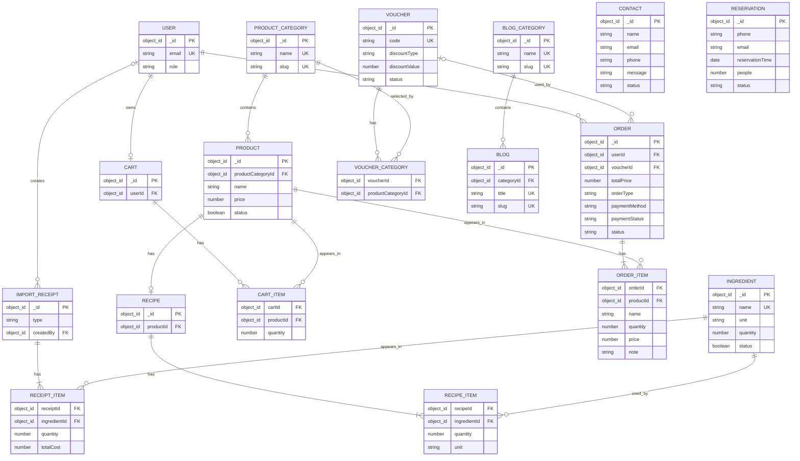
```mermaid
erDiagram
  USER ||--o| CART : owns
  USER ||--o{ ORDER : creates
  USER |o--o{ IMPORT_RECEIPT : creates
  PRODUCT_CATEGORY ||--o{ PRODUCT : contains
  PRODUCT ||--o| RECIPE : has
  CART ||--o{ CART_ITEM : has
  PRODUCT ||--o{ CART_ITEM : appears_in
  ORDER ||--|{ ORDER_ITEM : has
  PRODUCT ||--o{ ORDER_ITEM : appears_in
  RECIPE ||--|{ RECIPE_ITEM : has
  INGREDIENT ||--o{ RECIPE_ITEM : used_by
  IMPORT_RECEIPT ||--|{ RECEIPT_ITEM : has
  INGREDIENT ||--o{ RECEIPT_ITEM : appears_in
  VOUCHER |o--o{ ORDER : used_by
  VOUCHER ||--o{ VOUCHER_CATEGORY : has
  PRODUCT_CATEGORY ||--o{ VOUCHER_CATEGORY : selected_by
  BLOG_CATEGORY ||--o{ BLOG : contains

  USER {
    object_id _id PK
    string email UK
    string role
  }

  PRODUCT_CATEGORY {
    object_id _id PK
    string name UK
    string slug UK
  }

  PRODUCT {
    object_id _id PK
    object_id productCategoryId FK
    string name
    number price
    boolean status
  }

  INGREDIENT {
    object_id _id PK
    string name UK
    string unit
    number quantity
    boolean status
  }

  IMPORT_RECEIPT {
    object_id _id PK
    string type
    object_id createdBy FK
  }

  RECEIPT_ITEM {
    object_id receiptId FK
    object_id ingredientId FK
    number quantity
    number totalCost
  }

  RECIPE {
    object_id _id PK
    object_id productId FK
  }

  RECIPE_ITEM {
    object_id recipeId FK
    object_id ingredientId FK
    number quantity
    string unit
  }

  CART {
    object_id _id PK
    object_id userId FK
  }

  CART_ITEM {
    object_id cartId FK
    object_id productId FK
    number quantity
  }

  ORDER {
    object_id _id PK
    object_id userId FK
    object_id voucherId FK
    number totalPrice
    string orderType
    string paymentMethod
    string paymentStatus
    string status
  }

  ORDER_ITEM {
    object_id orderId FK
    object_id productId FK
    string name
    number quantity
    number price
    string note
  }

  VOUCHER {
    object_id _id PK
    string code UK
    string discountType
    number discountValue
    string status
  }

  VOUCHER_CATEGORY {
    object_id voucherId FK
    object_id productCategoryId FK
  }

  BLOG_CATEGORY {
    object_id _id PK
    string name UK
    string slug UK
  }

  BLOG {
    object_id _id PK
    object_id categoryId FK
    string title UK
    string slug UK
  }

  CONTACT {
    object_id _id PK
    string name
    string email
    string phone
    string message
    string status
  }

  RESERVATION {
    object_id _id PK
    string phone
    string email
    date reservationTime
    number people
    string status
  }
```

### 3.2.2. Mô hình dữ liệu mức logic

| Collection | Mục đích | Khóa chính | Liên kết chính |
|---|---|---|---|
| `users` | Lưu tài khoản khách hàng, nhân viên quản lý và quản trị viên. | `_id` | Được tham chiếu bởi `carts.userId`, `orders.userId`, `importreceipts.createdBy`. |
| `productcategories` | Lưu danh mục sản phẩm hiển thị trên menu. | `_id` | Được tham chiếu bởi `products.productCategoryId`, `vouchers.conditions.applicableCategories`. |
| `products` | Lưu thông tin sản phẩm/món bán. | `_id` | Thuộc một danh mục; được tham chiếu bởi `recipes.productId`, `carts.items.productId`, `orders.items.productId`. |
| `ingredients` | Lưu nguyên liệu và số lượng tồn kho. | `_id` | Được dùng trong `recipes.items.ingredientId`, `importreceipts.items.ingredientId`. |
| `importreceipts` | Lưu phiếu nhập/xuất kho nguyên liệu. | `_id` | Có thể lưu người tạo tại `createdBy`. |
| `recipes` | Lưu công thức định lượng nguyên liệu cho từng sản phẩm. | `_id` | Mỗi sản phẩm có tối đa một công thức qua `productId` unique. |
| `carts` | Lưu giỏ hàng hiện tại của từng người dùng. | `_id` | Mỗi user có một giỏ hàng qua `userId` unique. |
| `orders` | Lưu đơn hàng online/offline, thanh toán và trạng thái xử lý. | `_id` | Thuộc user, có thể áp dụng voucher. |
| `vouchers` | Lưu mã giảm giá, điều kiện áp dụng và giới hạn sử dụng. | `_id` | Có thể giới hạn theo danh mục sản phẩm. |
| `blogcategories` | Lưu danh mục bài viết. | `_id` | Được tham chiếu bởi `blogs.categoryId`. |
| `blogs` | Lưu bài viết/tin tức trên website. | `_id` | Thuộc một danh mục bài viết. |
| `contacts` | Lưu phản hồi/liên hệ của khách hàng. | `_id` | Không có khóa ngoại. |
| `reservations` | Lưu yêu cầu đặt bàn của khách hàng. | `_id` | Không có khóa ngoại. |

## 3.3. Đặc tả dữ liệu

Ghi chú: hệ thống dùng MongoDB nên các thực thể `CART_ITEM`, `ORDER_ITEM`, `RECIPE_ITEM`, `RECEIPT_ITEM`, `VOUCHER_CATEGORY` trong sơ đồ chỉ là cách biểu diễn dữ liệu nhúng/mảng tham chiếu, không phải collection riêng trong code.

### 3.3.1. Thực thể `User`

- Tên thực thể: `User`
- Collection: `users`
- Mô tả: Lưu tài khoản khách hàng, nhân viên quản lý và quản trị viên.
- Khóa thực thể: `_id`
- Thuộc tính chính:
  - `name`: họ tên người dùng.
  - `email`: email đăng nhập, bắt buộc và duy nhất.
  - `password`: mật khẩu đã mã hóa.
  - `role`: vai trò tài khoản, gồm `customer`, `manager`, `admin`.
  - `createdAt`, `updatedAt`: thời điểm tạo và cập nhật.

### 3.3.2. Thực thể `ProductCategory`

- Tên thực thể: `ProductCategory`
- Collection: `productcategories`
- Mô tả: Lưu danh mục sản phẩm dùng để phân loại menu.
- Khóa thực thể: `_id`
- Thuộc tính chính:
  - `name`: tên danh mục, bắt buộc và duy nhất.
  - `slug`: định danh URL, tự sinh từ `name`.
  - `image`: ảnh đại diện danh mục.
  - `createdAt`, `updatedAt`: thời điểm tạo và cập nhật.

### 3.3.3. Thực thể `Product`

- Tên thực thể: `Product`
- Collection: `products`
- Mô tả: Lưu thông tin sản phẩm/món bán trên hệ thống.
- Khóa thực thể: `_id`
- Khóa ngoại: `productCategoryId` tham chiếu `ProductCategory._id`.
- Thuộc tính chính:
  - `name`: tên sản phẩm.
  - `description`: mô tả sản phẩm.
  - `price`: giá gốc.
  - `image`: ảnh sản phẩm.
  - `status`: trạng thái bán/ngừng bán.
  - `discount`: phần trăm giảm giá trực tiếp trên sản phẩm.
  - `createdAt`, `updatedAt`: thời điểm tạo và cập nhật.

### 3.3.4. Thực thể `Ingredient`

- Tên thực thể: `Ingredient`
- Collection: `ingredients`
- Mô tả: Lưu thông tin nguyên liệu và số lượng tồn kho.
- Khóa thực thể: `_id`
- Thuộc tính chính:
  - `name`: tên nguyên liệu, bắt buộc và duy nhất.
  - `unit`: đơn vị tính, gồm `g`, `ml`, `cái`.
  - `quantity`: số lượng tồn kho hiện tại.
  - `lastPrice`: đơn giá nhập gần nhất.
  - `totalCost`: tổng giá trị tồn kho.
  - `status`: trạng thái còn sử dụng/ngừng sử dụng.
  - `createdAt`, `updatedAt`: thời điểm tạo và cập nhật.

### 3.3.5. Thực thể `ImportReceipt`

- Tên thực thể: `ImportReceipt`
- Collection: `importreceipts`
- Mô tả: Lưu phiếu nhập/xuất kho nguyên liệu.
- Khóa thực thể: `_id`
- Khóa ngoại: `createdBy` tham chiếu `User._id`, có thể `null` theo schema.
- Thuộc tính chính:
  - `items`: danh sách nguyên liệu trong phiếu, là mảng nhúng.
  - `note`: ghi chú phiếu.
  - `type`: loại phiếu, gồm `IMPORT`, `EXPORT`.
  - `createdAt`, `updatedAt`: thời điểm tạo và cập nhật.

### 3.3.6. Thực thể `ReceiptItem`

- Tên thực thể: `ReceiptItem`
- Kiểu lưu trữ: mảng nhúng trong `ImportReceipt.items`.
- Mô tả: Lưu chi tiết từng nguyên liệu trong một phiếu nhập/xuất.
- Khóa ngoại logic khi vẽ ERD: `receiptId` tham chiếu `ImportReceipt._id`, `ingredientId` tham chiếu `Ingredient._id`.
- Ghi chú lưu trữ: trong schema Mongoose thực tế, `receiptId` không lưu trong từng item vì item đã nằm bên trong `ImportReceipt.items`.
- Thuộc tính chính:
  - `ingredientName`: tên nguyên liệu tại thời điểm lập phiếu.
  - `unit`: đơn vị tính.
  - `quantity`: số lượng nhập/xuất.
  - `pricePerUnit`: đơn giá.
  - `totalCost`: thành tiền.

### 3.3.7. Thực thể `Recipe`

- Tên thực thể: `Recipe`
- Collection: `recipes`
- Mô tả: Lưu công thức định lượng nguyên liệu cho sản phẩm.
- Khóa thực thể: `_id`
- Khóa ngoại: `productId` tham chiếu `Product._id`, bắt buộc và duy nhất.
- Thuộc tính chính:
  - `items`: danh sách nguyên liệu trong công thức, là mảng nhúng.
  - `createdAt`, `updatedAt`: thời điểm tạo và cập nhật.

### 3.3.8. Thực thể `RecipeItem`

- Tên thực thể: `RecipeItem`
- Kiểu lưu trữ: mảng nhúng trong `Recipe.items`.
- Mô tả: Lưu định lượng một nguyên liệu trong công thức.
- Khóa ngoại logic khi vẽ ERD: `recipeId` tham chiếu `Recipe._id`, `ingredientId` tham chiếu `Ingredient._id`.
- Ghi chú lưu trữ: trong schema Mongoose thực tế, `recipeId` không lưu trong từng item vì item đã nằm bên trong `Recipe.items`.
- Thuộc tính chính:
  - `quantity`: định lượng nguyên liệu cần dùng.
  - `unit`: đơn vị định lượng, gồm `g`, `ml`, `cái`.

### 3.3.9. Thực thể `Cart`

- Tên thực thể: `Cart`
- Collection: `carts`
- Mô tả: Lưu giỏ hàng hiện tại của người dùng.
- Khóa thực thể: `_id`
- Khóa ngoại: `userId` tham chiếu `User._id`, bắt buộc và duy nhất.
- Thuộc tính chính:
  - `items`: danh sách sản phẩm trong giỏ, là mảng nhúng.
  - `createdAt`, `updatedAt`: thời điểm tạo và cập nhật.

### 3.3.10. Thực thể `CartItem`

- Tên thực thể: `CartItem`
- Kiểu lưu trữ: mảng nhúng trong `Cart.items`.
- Mô tả: Lưu một dòng sản phẩm trong giỏ hàng.
- Khóa ngoại logic khi vẽ ERD: `cartId` tham chiếu `Cart._id`, `productId` tham chiếu `Product._id`.
- Ghi chú lưu trữ: trong schema Mongoose thực tế, `cartId` không lưu trong từng item vì item đã nằm bên trong `Cart.items`.
- Thuộc tính chính:
  - `quantity`: số lượng sản phẩm.
  - `note`: ghi chú riêng cho món.

### 3.3.11. Thực thể `Order`

- Tên thực thể: `Order`
- Collection: `orders`
- Mô tả: Lưu đơn hàng online/offline, thông tin thanh toán và trạng thái xử lý.
- Khóa thực thể: `_id`
- Khóa ngoại: `userId` tham chiếu `User._id`; `voucherId` tham chiếu `Voucher._id` và có thể `null`.
- Thuộc tính chính:
  - `pagerNumber`: số thẻ bàn cho đơn offline.
  - `voucherDiscount`: số tiền giảm bởi voucher.
  - `items`: danh sách món trong đơn hàng, là mảng nhúng.
  - `totalPrice`: tổng tiền đơn hàng.
  - `delivery`: thông tin nhận hàng gồm tên, điện thoại, địa chỉ, ghi chú, thời gian nhận.
  - `orderType`: loại đơn `ONLINE` hoặc `OFFLINE`.
  - `paymentMethod`: phương thức thanh toán `CASH` hoặc `VNPAY`.
  - `paymentStatus`: trạng thái thanh toán `PENDING`, `SUCCESS`, `FAILED`.
  - `vnp_TxnRef`, `vnp_TransactionNo`, `vnp_PayDate`, `vnp_Amount`: thông tin giao dịch VNPAY.
  - `status`: trạng thái đơn `PROCESSING`, `COMPLETED`, `CANCELLED`.
  - `createdAt`, `updatedAt`: thời điểm tạo và cập nhật.

### 3.3.12. Thực thể `OrderItem`

- Tên thực thể: `OrderItem`
- Kiểu lưu trữ: mảng nhúng trong `Order.items`.
- Mô tả: Lưu thông tin sản phẩm tại thời điểm tạo đơn.
- Khóa ngoại logic khi vẽ ERD: `orderId` tham chiếu `Order._id`, `productId` tham chiếu `Product._id`.
- Ghi chú lưu trữ: trong schema Mongoose thực tế, `orderId` không lưu trong từng item vì item đã nằm bên trong `Order.items`.
- Thuộc tính chính:
  - `name`: tên món tại thời điểm đặt.
  - `quantity`: số lượng đặt.
  - `price`: giá bán tại thời điểm đặt.
  - `note`: ghi chú cho món.

### 3.3.13. Thực thể `Voucher`

- Tên thực thể: `Voucher`
- Collection: `vouchers`
- Mô tả: Lưu mã giảm giá, điều kiện áp dụng và giới hạn sử dụng.
- Khóa thực thể: `_id`
- Thuộc tính chính:
  - `code`: mã voucher, bắt buộc và duy nhất.
  - `description`: mô tả voucher.
  - `discountType`: kiểu giảm giá `percent` hoặc `amount`.
  - `discountValue`: giá trị giảm.
  - `startDate`, `endDate`: thời gian hiệu lực.
  - `usageLimit`, `usedCount`, `perUserLimit`: giới hạn và số lượt sử dụng.
  - `image`: ảnh voucher.
  - `conditions`: điều kiện áp dụng gồm giá trị đơn tối thiểu, danh mục áp dụng và mức giảm tối đa.
  - `status`: trạng thái `active` hoặc `inactive`.
  - `createdAt`, `updatedAt`: thời điểm tạo và cập nhật.

### 3.3.14. Thực thể `VoucherCategory`

- Tên thực thể: `VoucherCategory`
- Kiểu lưu trữ: mảng ObjectId trong `Voucher.conditions.applicableCategories`.
- Mô tả: Biểu diễn danh mục sản phẩm được áp dụng cho voucher.
- Khóa ngoại: `productCategoryId` tham chiếu `ProductCategory._id`.

### 3.3.15. Thực thể `BlogCategory`

- Tên thực thể: `BlogCategory`
- Collection: `blogcategories`
- Mô tả: Lưu danh mục bài viết/tin tức.
- Khóa thực thể: `_id`
- Thuộc tính chính:
  - `name`: tên danh mục bài viết, bắt buộc và duy nhất.
  - `slug`: định danh URL, tự sinh từ `name`.
  - `createdAt`, `updatedAt`: thời điểm tạo và cập nhật.

### 3.3.16. Thực thể `Blog`

- Tên thực thể: `Blog`
- Collection: `blogs`
- Mô tả: Lưu bài viết/tin tức trên website.
- Khóa thực thể: `_id`
- Khóa ngoại: `categoryId` tham chiếu `BlogCategory._id`.
- Thuộc tính chính:
  - `title`: tiêu đề bài viết, bắt buộc và duy nhất.
  - `slug`: định danh URL, tự sinh từ `title`.
  - `images`: danh sách ảnh bài viết.
  - `content`: nội dung chia thành `intro`, `body`, `conclusion`.
  - `createdAt`, `updatedAt`: thời điểm tạo và cập nhật.

### 3.3.17. Thực thể `Contact`

- Tên thực thể: `Contact`
- Collection: `contacts`
- Mô tả: Lưu phản hồi/liên hệ của khách hàng.
- Khóa thực thể: `_id`
- Khóa ngoại: không có.
- Thuộc tính chính:
  - `name`: tên người gửi.
  - `email`: email người gửi.
  - `phone`: số điện thoại người gửi.
  - `message`: nội dung liên hệ.
  - `status`: trạng thái `new` hoặc `read`.
  - `createdAt`, `updatedAt`: thời điểm tạo và cập nhật.

### 3.3.18. Thực thể `Reservation`

- Tên thực thể: `Reservation`
- Collection: `reservations`
- Mô tả: Lưu yêu cầu đặt bàn của khách hàng.
- Khóa thực thể: `_id`
- Thuộc tính chính:
  - `name`, `phone`, `email`: thông tin người đặt bàn.
  - `date`, `time`: ngày giờ đặt theo dữ liệu nhập.
  - `reservationTime`: thời điểm đặt bàn đã chuẩn hóa dạng `Date`.
  - `people`: số lượng khách.
  - `tableNumber`: số bàn được gán.
  - `note`: ghi chú.
  - `status`: trạng thái `PENDING`, `COMPLETED`, `CANCELLED`.
  - `createdAt`, `updatedAt`: thời điểm tạo và cập nhật.

## 3.4. Xác định mối quan hệ

### 3.4.1. Mối quan hệ `User` - `Cart`

- Mối quan hệ: 1 - 0..1.
- Mô tả: một người dùng có thể chưa có giỏ hàng hoặc có đúng một giỏ hàng; mỗi giỏ hàng bắt buộc thuộc về một người dùng.
- Cơ sở trong code: `Cart.userId` tham chiếu `User` và có `unique: true`.

### 3.4.2. Mối quan hệ `User` - `Order`

- Mối quan hệ: 1 - N.
- Mô tả: một người dùng có thể tạo nhiều đơn hàng; mỗi đơn hàng bắt buộc thuộc về một người dùng.
- Cơ sở trong code: `Order.userId` tham chiếu `User` và `required: true`.

### 3.4.3. Mối quan hệ `User` - `ImportReceipt`

- Mối quan hệ: 1 - N, phía `ImportReceipt.createdBy` là tùy chọn theo schema.
- Mô tả: một người dùng có thể tạo nhiều phiếu nhập/xuất; một phiếu có thể tham chiếu đến một người tạo hoặc để trống người tạo.
- Cơ sở trong code: `ImportReceipt.createdBy` tham chiếu `User` và có `default: null`; controller tạo phiếu hiện yêu cầu truyền `userId`.

### 3.4.4. Mối quan hệ `ProductCategory` - `Product`

- Mối quan hệ: 1 - N.
- Mô tả: một danh mục sản phẩm có thể chứa nhiều sản phẩm; mỗi sản phẩm bắt buộc thuộc về một danh mục.
- Cơ sở trong code: `Product.productCategoryId` tham chiếu `ProductCategory` và `required: true`.

### 3.4.5. Mối quan hệ `Product` - `Recipe`

- Mối quan hệ: 1 - 0..1.
- Mô tả: một sản phẩm có thể chưa có công thức hoặc có đúng một công thức; mỗi công thức bắt buộc thuộc về một sản phẩm.
- Cơ sở trong code: `Recipe.productId` tham chiếu `Product`, `required: true`, `unique: true`.

### 3.4.6. Mối quan hệ `Cart` - `CartItem`

- Mối quan hệ: 1 - 0..N.
- Mô tả: một giỏ hàng có thể chưa có sản phẩm hoặc có nhiều dòng sản phẩm; mỗi dòng sản phẩm chỉ nằm trong một giỏ hàng.
- Cơ sở trong code: `Cart.items` là mảng nhúng gồm `productId`, `quantity`, `note`.

### 3.4.7. Mối quan hệ `Product` - `CartItem`

- Mối quan hệ: 1 - N.
- Mô tả: một sản phẩm có thể xuất hiện trong nhiều dòng giỏ hàng; mỗi dòng giỏ hàng tham chiếu đến một sản phẩm.
- Cơ sở trong code: `Cart.items.productId` tham chiếu `Product`.

### 3.4.8. Mối quan hệ `Order` - `OrderItem`

- Mối quan hệ: 1 - N.
- Mô tả: một đơn hàng có một hoặc nhiều dòng món; mỗi dòng món thuộc về một đơn hàng.
- Cơ sở trong code: `Order.items` là mảng nhúng; controller tạo đơn từ danh sách `items` và kiểm tra giỏ/đơn không được rỗng.

### 3.4.9. Mối quan hệ `Product` - `OrderItem`

- Mối quan hệ: 1 - N.
- Mô tả: một sản phẩm có thể xuất hiện trong nhiều đơn hàng; mỗi dòng đơn hàng có thể tham chiếu đến một sản phẩm.
- Cơ sở trong code: `Order.items.productId` tham chiếu `Product`; các trường `name`, `price` được lưu lại để giữ thông tin tại thời điểm đặt.

### 3.4.10. Mối quan hệ `Recipe` - `RecipeItem`

- Mối quan hệ: 1 - N.
- Mô tả: một công thức có một hoặc nhiều dòng nguyên liệu; mỗi dòng nguyên liệu thuộc về một công thức.
- Cơ sở trong code: `Recipe.items` là mảng nhúng; controller yêu cầu `items.length > 0` khi tạo/cập nhật công thức.

### 3.4.11. Mối quan hệ `Ingredient` - `RecipeItem`

- Mối quan hệ: 1 - N.
- Mô tả: một nguyên liệu có thể được dùng trong nhiều công thức; mỗi dòng công thức tham chiếu đến một nguyên liệu.
- Cơ sở trong code: `Recipe.items.ingredientId` tham chiếu `Ingredient`.

### 3.4.12. Mối quan hệ `ImportReceipt` - `ReceiptItem`

- Mối quan hệ: 1 - N.
- Mô tả: một phiếu nhập/xuất có một hoặc nhiều dòng nguyên liệu; mỗi dòng nguyên liệu thuộc về một phiếu.
- Cơ sở trong code: `ImportReceipt.items` là mảng nhúng; controller yêu cầu danh sách `items` không được rỗng.

### 3.4.13. Mối quan hệ `Ingredient` - `ReceiptItem`

- Mối quan hệ: 1 - N.
- Mô tả: một nguyên liệu có thể xuất hiện trong nhiều phiếu nhập/xuất; mỗi dòng phiếu tham chiếu đến một nguyên liệu.
- Cơ sở trong code: `ImportReceipt.items.ingredientId` tham chiếu `Ingredient`.

### 3.4.14. Mối quan hệ `Voucher` - `Order`

- Mối quan hệ: 1 - N, phía `Order` là tùy chọn.
- Mô tả: một voucher có thể được áp dụng cho nhiều đơn hàng; một đơn hàng có thể không dùng voucher hoặc dùng một voucher.
- Cơ sở trong code: `Order.voucherId` tham chiếu `Voucher` và có `default: null`.

### 3.4.15. Mối quan hệ `Voucher` - `ProductCategory`

- Mối quan hệ: N - N ở mức logic.
- Mô tả: một voucher có thể áp dụng cho nhiều danh mục sản phẩm; một danh mục có thể xuất hiện trong nhiều voucher. Nếu danh sách danh mục rỗng, voucher không bị giới hạn theo danh mục.
- Cơ sở trong code: `Voucher.conditions.applicableCategories` là mảng ObjectId tham chiếu `ProductCategory`.

### 3.4.16. Mối quan hệ `BlogCategory` - `Blog`

- Mối quan hệ: 1 - N.
- Mô tả: một danh mục bài viết có thể chứa nhiều bài viết; mỗi bài viết bắt buộc thuộc về một danh mục.
- Cơ sở trong code: `Blog.categoryId` tham chiếu `BlogCategory` và `required: true`.

### 3.4.17. Thực thể không có quan hệ khóa ngoại

- `Contact`: lưu liên hệ/phản hồi khách hàng, không tham chiếu collection khác.
- `Reservation`: lưu yêu cầu đặt bàn, không tham chiếu collection khác.

## 3.5. Chi tiết các bảng lưu trữ dữ liệu

Ghi chú: vì hệ thống dùng MongoDB, thuật ngữ "bảng" trong phần này tương ứng với collection. Trường `_id`, `createdAt`, `updatedAt` do MongoDB/Mongoose quản lý; các trường thời gian chỉ có khi schema bật `timestamps: true`.

### 3.5.1. Bảng `user`

| Trường | Kiểu dữ liệu | Ràng buộc | Mô tả |
|---|---|---|---|
| `_id` | ObjectId | Khóa chính | Định danh tài khoản. |
| `name` | String | Required | Họ tên người dùng. |
| `email` | String | Required, unique | Email đăng nhập, không được trùng. |
| `password` | String | Required | Mật khẩu đã mã hóa bằng bcrypt. |
| `role` | String | Enum: `customer`, `manager`, `admin`; default `customer` | Vai trò phân quyền trong hệ thống. |
| `createdAt` | Date | Tự sinh | Thời điểm tạo tài khoản. |
| `updatedAt` | Date | Tự sinh | Thời điểm cập nhật gần nhất. |

### 3.5.2. Bảng `productCategory`

| Trường | Kiểu dữ liệu | Ràng buộc | Mô tả |
|---|---|---|---|
| `_id` | ObjectId | Khóa chính | Định danh danh mục sản phẩm. |
| `name` | String | Required, unique, trim | Tên danh mục. |
| `slug` | String | Unique, trim, tự sinh từ `name` | Chuỗi định danh dùng cho URL/lọc danh mục. |
| `image` | String | Required, trim | URL ảnh đại diện danh mục. |
| `createdAt` | Date | Tự sinh | Thời điểm tạo. |
| `updatedAt` | Date | Tự sinh | Thời điểm cập nhật. |

### 3.5.3. Bảng `product`

| Trường | Kiểu dữ liệu | Ràng buộc | Mô tả |
|---|---|---|---|
| `_id` | ObjectId | Khóa chính | Định danh sản phẩm. |
| `productCategoryId` | ObjectId | Required, ref `ProductCategory` | Danh mục chứa sản phẩm. |
| `name` | String | Required, trim | Tên sản phẩm. |
| `description` | String | Default `""` | Mô tả sản phẩm. |
| `price` | Number | Required, min `0` | Giá gốc. |
| `image` | String | Required | URL ảnh sản phẩm. |
| `status` | Boolean | Default `false` | Trạng thái bán/ẩn sản phẩm theo logic giao diện. |
| `discount` | Number | Default `0`, min `0`, max `100` | Phần trăm giảm giá của sản phẩm. |
| `createdAt` | Date | Tự sinh | Thời điểm tạo. |
| `updatedAt` | Date | Tự sinh | Thời điểm cập nhật. |

### 3.5.4. Bảng `ingredient`

| Trường | Kiểu dữ liệu | Ràng buộc | Mô tả |
|---|---|---|---|
| `_id` | ObjectId | Khóa chính | Định danh nguyên liệu. |
| `name` | String | Required, unique | Tên nguyên liệu. |
| `unit` | String | Required, enum: `g`, `ml`, `cái` | Đơn vị tính. |
| `quantity` | Number | Required, default `0`, min `0` | Số lượng tồn kho hiện tại. |
| `lastPrice` | Number | Default `0`, min `0` | Đơn giá nhập gần nhất. |
| `totalCost` | Number | Default `0`, min `0` | Tổng giá trị tồn kho dùng cho báo cáo nhanh. |
| `status` | Boolean | Default `false` | Trạng thái sử dụng/ngừng sử dụng nguyên liệu. |
| `createdAt` | Date | Tự sinh | Thời điểm tạo. |
| `updatedAt` | Date | Tự sinh | Thời điểm cập nhật. |

### 3.5.5. Bảng `receipt`

Trong code, collection này được khai báo bằng model `ImportReceipt`; trường `type` phân biệt phiếu nhập và phiếu xuất.

| Trường | Kiểu dữ liệu | Ràng buộc | Mô tả |
|---|---|---|---|
| `_id` | ObjectId | Khóa chính | Định danh phiếu. |
| `items` | Array | Danh sách bắt buộc theo nghiệp vụ | Danh sách nguyên liệu trong phiếu. |
| `items.ingredientId` | ObjectId | Required, ref `Ingredient` | Nguyên liệu được nhập/xuất. |
| `items.ingredientName` | String | Required | Tên nguyên liệu tại thời điểm lập phiếu. |
| `items.unit` | String | Required | Đơn vị tính tại thời điểm lập phiếu. |
| `items.quantity` | Number | Required, min `1` | Số lượng nhập/xuất. |
| `items.pricePerUnit` | Number | Required, min `0` | Đơn giá. |
| `items.totalCost` | Number | Required, min `0` | Thành tiền của dòng nguyên liệu. |
| `note` | String | Default `""` | Ghi chú phiếu. |
| `type` | String | Required, enum: `IMPORT`, `EXPORT` | Loại phiếu. |
| `createdBy` | ObjectId | Ref `User`, default `null` | Người tạo phiếu. |
| `createdAt` | Date | Tự sinh | Thời điểm tạo. |
| `updatedAt` | Date | Tự sinh | Thời điểm cập nhật. |

### 3.5.6. Bảng `recipe`

| Trường | Kiểu dữ liệu | Ràng buộc | Mô tả |
|---|---|---|---|
| `_id` | ObjectId | Khóa chính | Định danh công thức. |
| `productId` | ObjectId | Required, unique, ref `Product` | Sản phẩm áp dụng công thức; mỗi sản phẩm chỉ có một công thức. |
| `items` | Array | Required theo nghiệp vụ | Danh sách nguyên liệu trong công thức. |
| `items.ingredientId` | ObjectId | Required, ref `Ingredient` | Nguyên liệu sử dụng. |
| `items.quantity` | Number | Required, min `0` | Định lượng nguyên liệu. |
| `items.unit` | String | Required, enum: `g`, `ml`, `cái` | Đơn vị định lượng. |
| `createdAt` | Date | Tự sinh | Thời điểm tạo. |
| `updatedAt` | Date | Tự sinh | Thời điểm cập nhật. |

### 3.5.7. Bảng `cart`

| Trường | Kiểu dữ liệu | Ràng buộc | Mô tả |
|---|---|---|---|
| `_id` | ObjectId | Khóa chính | Định danh giỏ hàng. |
| `userId` | ObjectId | Required, unique, ref `User` | Người sở hữu giỏ hàng; mỗi user chỉ có một giỏ. |
| `items` | Array | Danh sách sản phẩm trong giỏ | Các dòng sản phẩm khách đã chọn. |
| `items.productId` | ObjectId | Required, ref `Product` | Sản phẩm trong giỏ. |
| `items.quantity` | Number | Required, min `1` | Số lượng sản phẩm. |
| `items.note` | String | Không bắt buộc | Ghi chú riêng cho món. |
| `createdAt` | Date | Tự sinh | Thời điểm tạo. |
| `updatedAt` | Date | Tự sinh | Thời điểm cập nhật. |

### 3.5.8. Bảng `order`

| Trường | Kiểu dữ liệu | Ràng buộc | Mô tả |
|---|---|---|---|
| `_id` | ObjectId | Khóa chính | Định danh đơn hàng. |
| `userId` | ObjectId | Required, ref `User` | Người tạo đơn. |
| `pagerNumber` | Number | Default `null` | Số thẻ bàn cho đơn offline. |
| `voucherId` | ObjectId | Ref `Voucher`, default `null` | Voucher được áp dụng nếu có. |
| `voucherDiscount` | Number | Default `0` | Số tiền được giảm bởi voucher. |
| `items` | Array | Required theo nghiệp vụ | Danh sách món trong đơn hàng. |
| `items.productId` | ObjectId | Ref `Product` | Sản phẩm được đặt. |
| `items.name` | String | Required | Tên món tại thời điểm đặt. |
| `items.quantity` | Number | Required | Số lượng món. |
| `items.price` | Number | Required | Giá bán tại thời điểm đặt. |
| `items.note` | String | Default `""` | Ghi chú cho món. |
| `totalPrice` | Number | Required | Tổng tiền sau khi tính giảm giá/phí liên quan. |
| `delivery.name` | String | Default `null` | Tên người nhận. |
| `delivery.phone` | String | Default `null` | Số điện thoại người nhận. |
| `delivery.address` | String | Default `null` | Địa chỉ giao hàng. |
| `delivery.note` | String | Default `""` | Ghi chú giao hàng. |
| `delivery.deliveryTime` | String | Default `Càng sớm càng tốt` | Thời gian nhận hàng mong muốn. |
| `orderType` | String | Required, enum: `ONLINE`, `OFFLINE` | Loại đơn hàng. |
| `paymentMethod` | String | Required, enum: `CASH`, `VNPAY` | Phương thức thanh toán. |
| `paymentStatus` | String | Enum: `PENDING`, `SUCCESS`, `FAILED`; default `PENDING` | Trạng thái thanh toán. |
| `vnp_TxnRef` | String | Default `null` | Mã tham chiếu giao dịch VNPAY. |
| `vnp_TransactionNo` | String | Default `null` | Mã giao dịch do VNPAY trả về. |
| `vnp_PayDate` | String | Default `null` | Thời gian thanh toán VNPAY. |
| `vnp_Amount` | Number | Default `null` | Số tiền thanh toán VNPAY. |
| `status` | String | Enum: `PROCESSING`, `COMPLETED`, `CANCELLED`; default `PROCESSING` | Trạng thái xử lý đơn hàng. |
| `createdAt` | Date | Tự sinh | Thời điểm tạo. |
| `updatedAt` | Date | Tự sinh | Thời điểm cập nhật. |

Chỉ mục phụ: schema tạo compound index `{ userId: 1, voucherId: 1 }` để truy vấn nhanh lịch sử sử dụng voucher theo người dùng.

### 3.5.9. Bảng `voucher`

| Trường | Kiểu dữ liệu | Ràng buộc | Mô tả |
|---|---|---|---|
| `_id` | ObjectId | Khóa chính | Định danh voucher. |
| `code` | String | Required, unique, minlength `6` | Mã voucher. |
| `description` | String | Required | Mô tả chương trình giảm giá. |
| `discountType` | String | Required, enum: `percent`, `amount` | Kiểu giảm giá theo phần trăm hoặc số tiền cố định. |
| `discountValue` | Number | Required, min `1` | Giá trị giảm. |
| `startDate` | Date | Required | Ngày bắt đầu hiệu lực. |
| `endDate` | Date | Required | Ngày hết hiệu lực. |
| `usageLimit` | Number | Required, min `1` | Tổng số lượt sử dụng tối đa. |
| `usedCount` | Number | Default `0` | Số lượt đã sử dụng. |
| `perUserLimit` | Number | Required, min `0` | Giới hạn số lượt dùng trên mỗi user. |
| `image` | String | Required | URL ảnh voucher. |
| `conditions.minOrderValue` | Number | Required, min `0` | Giá trị đơn hàng tối thiểu. |
| `conditions.applicableCategories` | Array ObjectId | Ref `ProductCategory` | Danh mục sản phẩm được áp dụng. |
| `conditions.maxDiscountAmount` | Number | Default `null` | Mức giảm tối đa với voucher phần trăm. |
| `status` | String | Enum: `active`, `inactive`; default `active` | Trạng thái hoạt động. |
| `createdAt` | Date | Tự sinh | Thời điểm tạo. |
| `updatedAt` | Date | Tự sinh | Thời điểm cập nhật. |

### 3.5.10. Bảng `blogCategory`

| Trường | Kiểu dữ liệu | Ràng buộc | Mô tả |
|---|---|---|---|
| `_id` | ObjectId | Khóa chính | Định danh danh mục bài viết. |
| `name` | String | Required, unique, trim | Tên danh mục bài viết. |
| `slug` | String | Unique, trim, tự sinh từ `name` | Chuỗi định danh danh mục. |
| `createdAt` | Date | Tự sinh | Thời điểm tạo. |
| `updatedAt` | Date | Tự sinh | Thời điểm cập nhật. |

### 3.5.11. Bảng `blog`

| Trường | Kiểu dữ liệu | Ràng buộc | Mô tả |
|---|---|---|---|
| `_id` | ObjectId | Khóa chính | Định danh bài viết. |
| `title` | String | Required, unique, trim | Tiêu đề bài viết. |
| `slug` | String | Unique, trim, tự sinh từ `title` | Chuỗi định danh bài viết. |
| `categoryId` | ObjectId | Required, ref `BlogCategory` | Danh mục của bài viết. |
| `images` | Array String | Trim | Danh sách ảnh của bài viết. |
| `content.intro.text` | String | Required, trim | Nội dung mở đầu. |
| `content.intro.highlight` | String | Trim | Phần nhấn mạnh ở mở đầu. |
| `content.body.text` | String | Required, trim | Nội dung chính. |
| `content.body.highlight` | String | Trim | Phần nhấn mạnh ở thân bài. |
| `content.conclusion.text` | String | Required, trim | Nội dung kết luận. |
| `content.conclusion.highlight` | String | Trim | Phần nhấn mạnh ở kết luận. |
| `createdAt` | Date | Tự sinh | Thời điểm tạo. |
| `updatedAt` | Date | Tự sinh | Thời điểm cập nhật. |

### 3.5.12. Bảng `contact`

| Trường | Kiểu dữ liệu | Ràng buộc | Mô tả |
|---|---|---|---|
| `_id` | ObjectId | Khóa chính | Định danh liên hệ. |
| `name` | String | Required, trim | Tên người gửi. |
| `email` | String | Required, trim | Email người gửi. |
| `phone` | String | Required, trim | Số điện thoại người gửi. |
| `message` | String | Required, trim | Nội dung phản hồi/liên hệ. |
| `status` | String | Enum: `new`, `read`; default `new` | Trạng thái đọc của phản hồi. |
| `createdAt` | Date | Tự sinh | Thời điểm tạo. |
| `updatedAt` | Date | Tự sinh | Thời điểm cập nhật. |

### 3.5.13. Bảng `reservation`

| Trường | Kiểu dữ liệu | Ràng buộc | Mô tả |
|---|---|---|---|
| `_id` | ObjectId | Khóa chính | Định danh yêu cầu đặt bàn. |
| `name` | String | Required, trim | Tên người đặt bàn. |
| `phone` | String | Required | Số điện thoại liên hệ. |
| `email` | String | Required, trim | Email liên hệ. |
| `date` | String | Required | Ngày đặt bàn theo dữ liệu nhập từ frontend. |
| `time` | String | Required | Giờ đặt bàn theo dữ liệu nhập từ frontend. |
| `reservationTime` | Date | Required, index | Thời điểm đặt bàn đã chuẩn hóa để truy vấn và watcher xử lý. |
| `people` | Number | Required, min `1`, max `20` | Số lượng khách. |
| `tableNumber` | Number | Min `1`, max `24` | Số bàn được gán. |
| `note` | String | Default `""` | Ghi chú của khách. |
| `status` | String | Enum: `PENDING`, `COMPLETED`, `CANCELLED`; default `PENDING`, index | Trạng thái đặt bàn. |
| `createdAt` | Date | Tự sinh | Thời điểm tạo. |
| `updatedAt` | Date | Tự sinh | Thời điểm cập nhật. |

## Bổ sung 3.3.2. Chức năng đăng nhập: Quên mật khẩu và đổi mật khẩu

### Biểu đồ UseCase quên mật khẩu và đổi mật khẩu

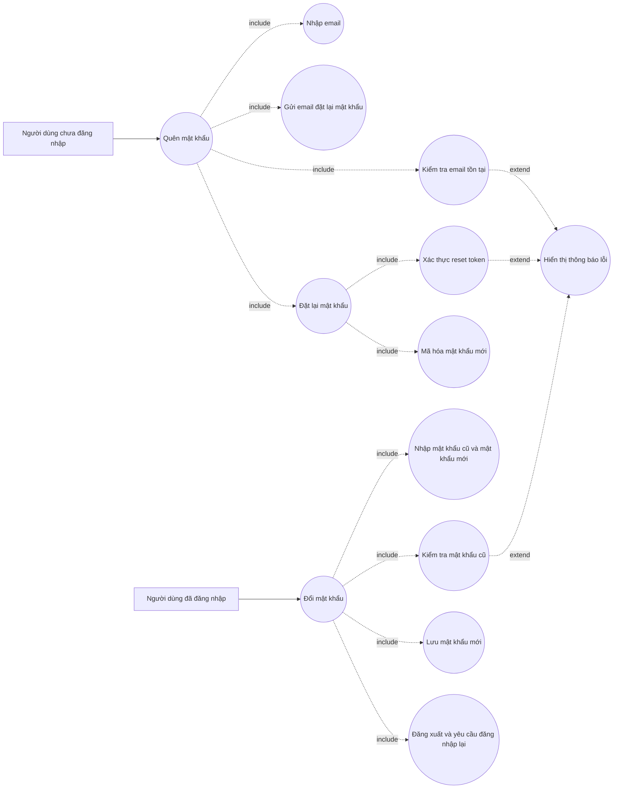
```mermaid
flowchart LR
  Guest[Người dùng chưa đăng nhập] --> Forgot((Quên mật khẩu))
  Forgot -. include .-> EnterEmail((Nhập email))
  Forgot -. include .-> CheckEmail((Kiểm tra email tồn tại))
  Forgot -. include .-> SendMail((Gửi email đặt lại mật khẩu))
  Forgot -. include .-> Reset((Đặt lại mật khẩu))
  Reset -. include .-> VerifyToken((Xác thực reset token))
  Reset -. include .-> HashNewPass((Mã hóa mật khẩu mới))

  User[Người dùng đã đăng nhập] --> Change((Đổi mật khẩu))
  Change -. include .-> EnterPass((Nhập mật khẩu cũ và mật khẩu mới))
  Change -. include .-> CheckOldPass((Kiểm tra mật khẩu cũ))
  Change -. include .-> SaveNewPass((Lưu mật khẩu mới))
  Change -. include .-> Logout((Đăng xuất và yêu cầu đăng nhập lại))

  CheckEmail -. extend .-> Error((Hiển thị thông báo lỗi))
  VerifyToken -. extend .-> Error
  CheckOldPass -. extend .-> Error
```

### Bảng đặc tả UseCase quên mật khẩu

| UC | Quên mật khẩu |
|---|---|
| Tác nhân | Người dùng chưa đăng nhập |
| Mô tả | Người dùng nhập email đã đăng ký. Hệ thống kiểm tra email tồn tại, sinh reset token và gửi liên kết đặt lại mật khẩu qua email. Người dùng mở liên kết, nhập mật khẩu mới, hệ thống xác thực token và cập nhật mật khẩu đã mã hóa. |
| Tiền điều kiện | Email đã tồn tại trong hệ thống. |
| Hậu điều kiện thành công | Mật khẩu mới được hash bằng bcrypt và lưu vào tài khoản; người dùng được chuyển về trang đăng nhập. |
| Hậu điều kiện lỗi | Hiển thị lỗi nếu email không tồn tại, mật khẩu mới dưới 8 ký tự, token không hợp lệ hoặc đã hết hạn. |

### Bảng đặc tả UseCase đổi mật khẩu

| UC | Đổi mật khẩu |
|---|---|
| Tác nhân | Người dùng đã đăng nhập |
| Mô tả | Người dùng nhập mật khẩu cũ, mật khẩu mới và xác nhận mật khẩu mới. Hệ thống kiểm tra mật khẩu cũ, hash mật khẩu mới, lưu vào database và yêu cầu người dùng đăng nhập lại. |
| Tiền điều kiện | Người dùng đã đăng nhập; request có JWT hợp lệ. |
| Hậu điều kiện thành công | Mật khẩu được cập nhật; frontend xóa token/user localStorage, gọi logout và chuyển về trang đăng nhập. |
| Hậu điều kiện lỗi | Hiển thị lỗi nếu thiếu thông tin, xác nhận mật khẩu không khớp, token không hợp lệ, không tìm thấy user hoặc mật khẩu cũ không đúng. |

### Đặc tả chức năng

| Luồng | Nội dung |
|---|---|
| Luồng quên mật khẩu | 1. Người dùng chọn chức năng quên mật khẩu tại trang đăng nhập. |
|  | 2. Frontend hiển thị form nhập email. |
|  | 3. Người dùng nhập email và gửi yêu cầu. |
|  | 4. Frontend kiểm tra email không được để trống. |
|  | 5. Frontend gọi `POST /auth/forgot-password`. |
|  | 6. Backend tìm user theo email. |
|  | 7. Nếu email tồn tại, backend sinh reset token bằng JWT với thời hạn 15 phút. |
|  | 8. Backend gửi email chứa link `/account/reset-password?token=...` bằng Nodemailer. |
|  | 9. Frontend hiển thị thông báo yêu cầu kiểm tra email. |
| Luồng đặt lại mật khẩu | 1. Người dùng mở link đặt lại mật khẩu từ email. |
|  | 2. Frontend lấy `token` từ query string và hiển thị form nhập mật khẩu mới. |
|  | 3. Người dùng nhập mật khẩu mới và gửi form. |
|  | 4. Frontend gọi `POST /auth/reset-password?token=...`. |
|  | 5. Backend xác thực token bằng `jwt.verify`. |
|  | 6. Backend kiểm tra mật khẩu mới tối thiểu 8 ký tự. |
|  | 7. Backend tìm user theo `decoded.id`, hash mật khẩu mới bằng bcrypt và lưu lại. |
|  | 8. Frontend hiển thị thành công và chuyển về trang đăng nhập sau 2 giây. |
| Luồng đổi mật khẩu | 1. Người dùng đã đăng nhập mở trang đổi mật khẩu trong profile. |
|  | 2. Frontend hiển thị form mật khẩu cũ, mật khẩu mới và xác nhận mật khẩu mới. |
|  | 3. Frontend kiểm tra các trường không rỗng và mật khẩu xác nhận trùng khớp. |
|  | 4. Frontend gọi `PUT /auth/change-password` kèm Bearer token. |
|  | 5. Middleware `verifyToken` xác thực JWT và gắn `req.user`. |
|  | 6. Backend tìm user theo `req.user.id`. |
|  | 7. Backend so sánh mật khẩu cũ bằng bcrypt. |
|  | 8. Nếu hợp lệ, backend hash mật khẩu mới và lưu vào database. |
|  | 9. Frontend xóa token/user trong localStorage, logout và chuyển về trang đăng nhập. |
| Luồng phụ | 1. Nếu email không tồn tại, backend trả lỗi `Email không tồn tại`. |
|  | 2. Nếu reset token không hợp lệ/hết hạn, backend trả lỗi token. |
|  | 3. Nếu mật khẩu cũ không đúng, backend trả lỗi `Mật khẩu cũ không đúng`. |
|  | 4. Nếu JWT đổi mật khẩu hết hạn/không hợp lệ, middleware yêu cầu đăng nhập lại. |

### Biểu đồ hoạt động quên mật khẩu và đổi mật khẩu

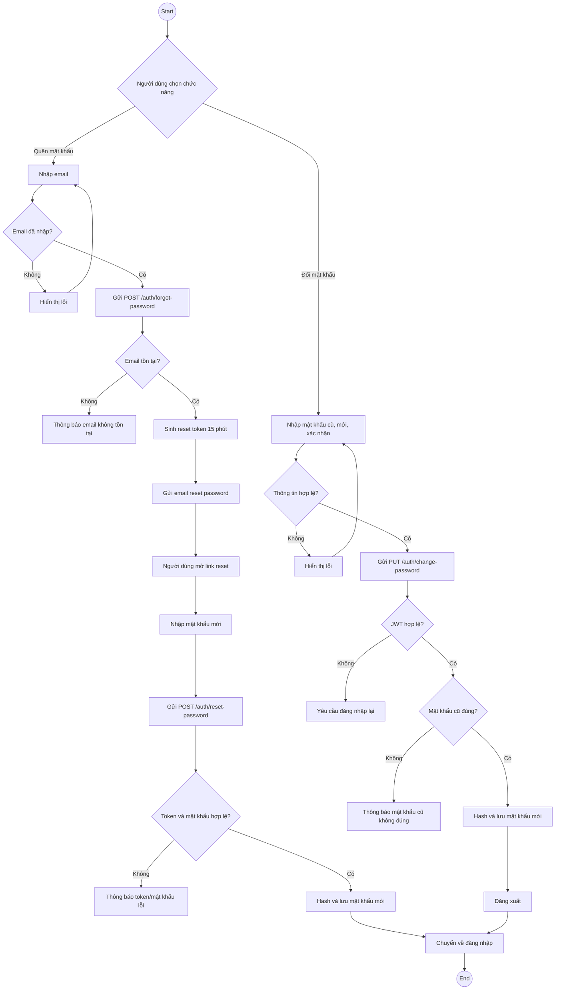
```mermaid
flowchart TB
  Start((Start)) --> Action{Người dùng chọn chức năng}
  Action -- Quên mật khẩu --> Email[Nhập email]
  Email --> CheckEmailFE{Email đã nhập?}
  CheckEmailFE -- Không --> ErrorFE[Hiển thị lỗi] --> Email
  CheckEmailFE -- Có --> ForgotAPI[Gửi POST /auth/forgot-password]
  ForgotAPI --> EmailExists{Email tồn tại?}
  EmailExists -- Không --> ErrorEmail[Thông báo email không tồn tại]
  EmailExists -- Có --> Token[Sinh reset token 15 phút]
  Token --> Mail[Gửi email reset password]
  Mail --> OpenLink[Người dùng mở link reset]
  OpenLink --> NewPass[Nhập mật khẩu mới]
  NewPass --> ResetAPI[Gửi POST /auth/reset-password]
  ResetAPI --> TokenOK{Token và mật khẩu hợp lệ?}
  TokenOK -- Không --> ErrorToken[Thông báo token/mật khẩu lỗi]
  TokenOK -- Có --> SaveReset[Hash và lưu mật khẩu mới]
  SaveReset --> Login[Chuyển về đăng nhập]

  Action -- Đổi mật khẩu --> Form[Nhập mật khẩu cũ, mới, xác nhận]
  Form --> CheckForm{Thông tin hợp lệ?}
  CheckForm -- Không --> ErrorChange[Hiển thị lỗi] --> Form
  CheckForm -- Có --> ChangeAPI[Gửi PUT /auth/change-password]
  ChangeAPI --> AuthOK{JWT hợp lệ?}
  AuthOK -- Không --> Relogin[Yêu cầu đăng nhập lại]
  AuthOK -- Có --> OldPass{Mật khẩu cũ đúng?}
  OldPass -- Không --> ErrorOld[Thông báo mật khẩu cũ không đúng]
  OldPass -- Có --> SaveChange[Hash và lưu mật khẩu mới]
  SaveChange --> Logout[Đăng xuất]
  Logout --> Login
  Login --> End((End))
```

### Biểu đồ tuần tự quên mật khẩu và đổi mật khẩu

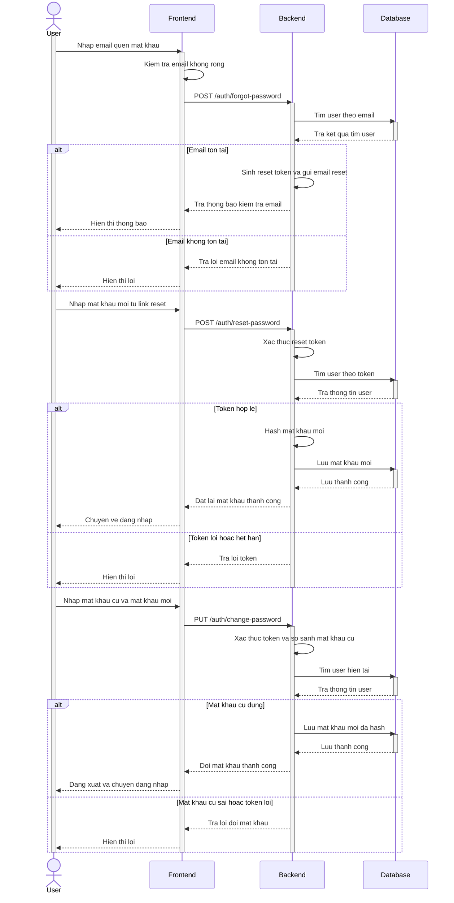
```mermaid
sequenceDiagram
  actor User as User
  participant FE as Frontend
  participant BE as Backend
  participant DB as Database

  activate User
  User->>FE: Nhap email quen mat khau
  activate FE
  FE->>FE: Kiem tra email khong rong
  FE->>BE: POST /auth/forgot-password
  activate BE
  BE->>DB: Tim user theo email
  activate DB
  DB-->>BE: Tra ket qua tim user
  deactivate DB
  alt Email ton tai
    BE->>BE: Sinh reset token va gui email reset
    BE-->>FE: Tra thong bao kiem tra email
    FE-->>User: Hien thi thong bao
  else Email khong ton tai
    BE-->>FE: Tra loi email khong ton tai
    FE-->>User: Hien thi loi
  end
  deactivate BE

  User->>FE: Nhap mat khau moi tu link reset
  FE->>BE: POST /auth/reset-password
  activate BE
  BE->>BE: Xac thuc reset token
  BE->>DB: Tim user theo token
  activate DB
  DB-->>BE: Tra thong tin user
  deactivate DB
  alt Token hop le
    BE->>BE: Hash mat khau moi
    BE->>DB: Luu mat khau moi
    activate DB
    DB-->>BE: Luu thanh cong
    deactivate DB
    BE-->>FE: Dat lai mat khau thanh cong
    FE-->>User: Chuyen ve dang nhap
  else Token loi hoac het han
    BE-->>FE: Tra loi token
    FE-->>User: Hien thi loi
  end
  deactivate BE

  User->>FE: Nhap mat khau cu va mat khau moi
  FE->>BE: PUT /auth/change-password
  activate BE
  BE->>BE: Xac thuc token va so sanh mat khau cu
  BE->>DB: Tim user hien tai
  activate DB
  DB-->>BE: Tra thong tin user
  deactivate DB
  alt Mat khau cu dung
    BE->>DB: Luu mat khau moi da hash
    activate DB
    DB-->>BE: Luu thanh cong
    deactivate DB
    BE-->>FE: Doi mat khau thanh cong
    FE-->>User: Dang xuat va chuyen dang nhap
  else Mat khau cu sai hoac token loi
    BE-->>FE: Tra loi doi mat khau
    FE-->>User: Hien thi loi
  end
  deactivate BE
  deactivate FE
  deactivate User
```

## 3.3.3. Chức năng đặt hàng và thanh toán

### Biểu đồ UseCase chức năng đặt hàng và thanh toán

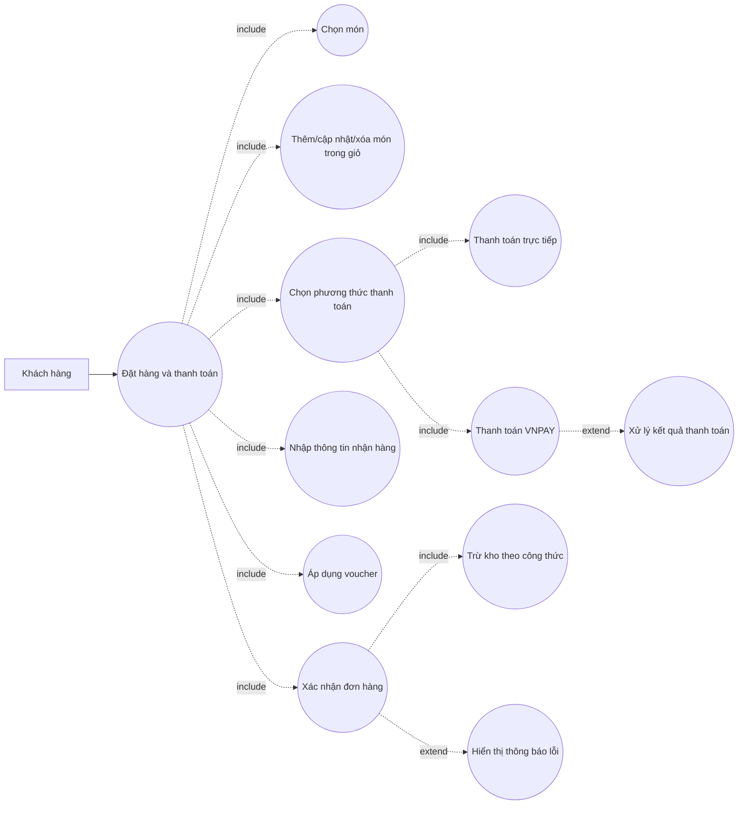
```mermaid
flowchart LR
  Customer[Khách hàng] --> UC((Đặt hàng và thanh toán))
  UC -. include .-> ChonMon((Chọn món))
  UC -. include .-> GioHang((Thêm/cập nhật/xóa món trong giỏ))
  UC -. include .-> Checkout((Xác nhận đơn hàng))
  UC -. include .-> GiaoHang((Nhập thông tin nhận hàng))
  UC -. include .-> Voucher((Áp dụng voucher))
  UC -. include .-> ThanhToan((Chọn phương thức thanh toán))
  ThanhToan -. include .-> Cash((Thanh toán trực tiếp))
  ThanhToan -. include .-> Vnpay((Thanh toán VNPAY))
  Checkout -. include .-> TruKho((Trừ kho theo công thức))
  Vnpay -. extend .-> KetQua((Xử lý kết quả thanh toán))
  Checkout -. extend .-> Loi((Hiển thị thông báo lỗi))
```

### Bảng đặc tả UseCase đặt hàng và thanh toán

| UC | Đặt hàng và thanh toán |
|---|---|
| Tác nhân | Khách hàng đã đăng nhập |
| Mô tả | Khách hàng chọn sản phẩm từ menu, thêm vào giỏ hàng, cập nhật số lượng/ghi chú, nhập thông tin nhận hàng, áp dụng voucher nếu có và chọn thanh toán trực tiếp hoặc VNPAY. Backend tạo đơn online, tính tiền, trừ kho theo công thức, xử lý kết quả thanh toán và xóa giỏ hàng khi thanh toán thành công. |
| Tiền điều kiện | Khách hàng đã đăng nhập; giỏ hàng có ít nhất một sản phẩm; sản phẩm còn bán; sản phẩm có công thức; kho đủ nguyên liệu; nếu áp voucher thì voucher hợp lệ. |
| Hậu điều kiện thành công | Đơn hàng `ONLINE` được tạo. Nếu thanh toán trực tiếp, đơn trả về `orderId` và giỏ hàng được xóa. Nếu thanh toán VNPAY thành công, đơn chuyển `paymentStatus = SUCCESS`, lưu thông tin giao dịch VNPAY, tăng lượt dùng voucher nếu có và xóa giỏ hàng. |
| Hậu điều kiện lỗi | Hệ thống hiển thị lỗi nếu giỏ hàng trống, thiếu thông tin giao hàng, sản phẩm ngừng bán, sản phẩm chưa có công thức, kho không đủ nguyên liệu, voucher không hợp lệ hoặc thanh toán VNPAY thất bại. Khi VNPAY thất bại/hết hạn, hệ thống hủy đơn và hoàn nguyên liệu. |

### Đặc tả chức năng

| Luồng | Nội dung |
|---|---|
| Luồng chính | 1. Khách hàng mở menu và chọn sản phẩm. |
|  | 2. Frontend mở modal chi tiết sản phẩm, khách chọn số lượng và nhập ghi chú nếu cần. |
|  | 3. Frontend gọi `POST /carts/:userId` để thêm món vào giỏ hàng. |
|  | 4. Khách hàng vào trang checkout. |
|  | 5. Frontend hiển thị danh sách món trong giỏ, cho phép sửa số lượng/ghi chú hoặc xóa món. |
|  | 6. Khách hàng chọn cách nhận hàng: giao tận nơi hoặc đến quán lấy. |
|  | 7. Khách hàng nhập tên người nhận, số điện thoại, địa chỉ nếu giao hàng, ghi chú giao hàng và thời gian nhận. |
|  | 8. Nếu có voucher, khách nhập mã và frontend gọi `POST /vouchers/check-voucher`. |
|  | 9. Hệ thống kiểm tra điều kiện voucher và trả số tiền giảm. |
|  | 10. Khách chọn phương thức thanh toán `VNPAY` hoặc `CASH`. |
|  | 11. Frontend gửi `POST /payment/create` với giỏ hàng, giao hàng, voucher, userId và phương thức thanh toán. |
|  | 12. Backend kiểm tra thông tin giao hàng và giỏ hàng. |
|  | 13. Backend tính tổng tiền theo giá sản phẩm, giảm giá sản phẩm, phí giao hàng và voucher. |
|  | 14. Backend tìm công thức từng món và trừ nguyên liệu trong kho bằng transaction. |
|  | 15. Backend tạo đơn hàng `ONLINE` với trạng thái thanh toán `PENDING`. |
| Luồng thanh toán trực tiếp | 1. Nếu phương thức là `CASH`, backend tăng `usedCount` voucher nếu có. |
|  | 2. Backend xóa giỏ hàng trong database. |
|  | 3. Backend trả `orderId`, frontend xóa giỏ local và chuyển sang trang kết quả thanh toán. |
| Luồng VNPAY | 1. Nếu phương thức là `VNPAY`, backend tạo URL thanh toán VNPAY và trả về frontend. |
|  | 2. Frontend chuyển trình duyệt sang cổng thanh toán VNPAY. |
|  | 3. VNPAY gọi callback `GET /payment/vnpay-return`. |
|  | 4. Backend xác thực chữ ký callback. |
|  | 5. Nếu thanh toán thành công, backend cập nhật `paymentStatus = SUCCESS`, lưu mã giao dịch, số tiền, thời gian thanh toán, tăng lượt dùng voucher nếu có và xóa giỏ hàng. |
|  | 6. Backend redirect về trang kết quả thanh toán với `orderId`. |
| Luồng phụ | 1. Nếu khách chưa đăng nhập khi thêm món, hệ thống chuyển đến trang đăng nhập kèm redirect. |
|  | 2. Nếu voucher không hợp lệ, hệ thống hiển thị lỗi và không trừ tiền. |
|  | 3. Nếu sản phẩm ngừng bán, chưa có công thức hoặc kho không đủ nguyên liệu, backend rollback transaction và trả lỗi. |
|  | 4. Nếu VNPAY thất bại hoặc đơn quá hạn 15 phút chưa thanh toán, backend hủy đơn, đặt thanh toán `FAILED` và hoàn nguyên liệu. |

### Biểu đồ hoạt động chức năng đặt hàng và thanh toán

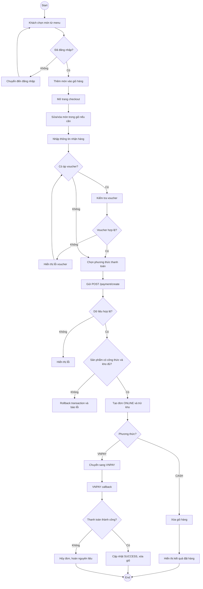
```mermaid
flowchart TB
  Start((Start)) --> Chon[Khách chọn món từ menu]
  Chon --> Login{Đã đăng nhập?}
  Login -- Không --> DangNhap[Chuyển đến đăng nhập] --> Chon
  Login -- Có --> AddCart[Thêm món vào giỏ hàng]
  AddCart --> Checkout[Mở trang checkout]
  Checkout --> UpdateCart[Sửa/xóa món trong giỏ nếu cần]
  UpdateCart --> Delivery[Nhập thông tin nhận hàng]
  Delivery --> ApplyVoucher{Có áp voucher?}
  ApplyVoucher -- Có --> CheckVoucher[Kiểm tra voucher]
  CheckVoucher --> VoucherOK{Voucher hợp lệ?}
  VoucherOK -- Không --> VoucherError[Hiển thị lỗi voucher] --> ApplyVoucher
  VoucherOK -- Có --> PaymentMethod[Chọn phương thức thanh toán]
  ApplyVoucher -- Không --> PaymentMethod
  PaymentMethod --> CreatePayment[Gửi POST /payment/create]
  CreatePayment --> Validate{Dữ liệu hợp lệ?}
  Validate -- Không --> Error[Hiển thị lỗi]
  Validate -- Có --> Stock{Sản phẩm có công thức và kho đủ?}
  Stock -- Không --> Rollback[Rollback transaction và báo lỗi]
  Stock -- Có --> CreateOrder[Tạo đơn ONLINE và trừ kho]
  CreateOrder --> Method{Phương thức?}
  Method -- CASH --> ClearCart[Xóa giỏ hàng]
  ClearCart --> CashResult[Hiển thị kết quả đặt hàng]
  Method -- VNPAY --> Redirect[Chuyển sang VNPAY]
  Redirect --> Callback[VNPAY callback]
  Callback --> Paid{Thanh toán thành công?}
  Paid -- Có --> Success[Cập nhật SUCCESS, xóa giỏ]
  Paid -- Không --> Failed[Hủy đơn, hoàn nguyên liệu]
  CashResult --> End((End))
  Success --> End
  Failed --> End
```

### Biểu đồ tuần tự chức năng đặt hàng và thanh toán

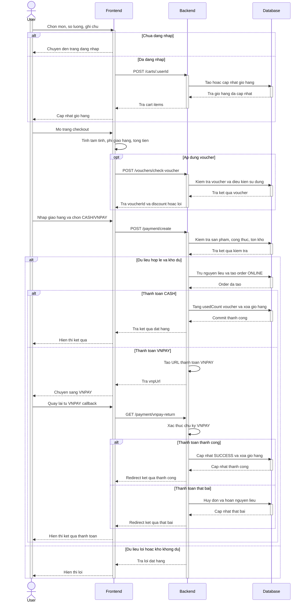
```mermaid
sequenceDiagram
  actor User as User
  participant FE as Frontend
  participant BE as Backend
  participant DB as Database

  activate User
  User->>FE: Chon mon, so luong, ghi chu
  activate FE
  alt Chua dang nhap
    FE-->>User: Chuyen den trang dang nhap
  else Da dang nhap
    FE->>BE: POST /carts/:userId
    activate BE
    BE->>DB: Tao hoac cap nhat gio hang
    activate DB
    DB-->>BE: Tra gio hang da cap nhat
    deactivate DB
    BE-->>FE: Tra cart items
    deactivate BE
    FE-->>User: Cap nhat gio hang
  end

  User->>FE: Mo trang checkout
  FE->>FE: Tinh tam tinh, phi giao hang, tong tien
  opt Ap dung voucher
    FE->>BE: POST /vouchers/check-voucher
    activate BE
    BE->>DB: Kiem tra voucher va dieu kien su dung
    activate DB
    DB-->>BE: Tra ket qua voucher
    deactivate DB
    BE-->>FE: Tra voucherId va discount hoac loi
    deactivate BE
  end

  User->>FE: Nhap giao hang va chon CASH/VNPAY
  FE->>BE: POST /payment/create
  activate BE
  BE->>DB: Kiem tra san pham, cong thuc, ton kho
  activate DB
  DB-->>BE: Tra ket qua kiem tra
  deactivate DB
  alt Du lieu hop le va kho du
    BE->>DB: Tru nguyen lieu va tao order ONLINE
    activate DB
    DB-->>BE: Order da tao
    deactivate DB
    alt Thanh toan CASH
      BE->>DB: Tang usedCount voucher va xoa gio hang
      activate DB
      DB-->>BE: Commit thanh cong
      deactivate DB
      BE-->>FE: Tra ket qua dat hang
      FE-->>User: Hien thi ket qua
    else Thanh toan VNPAY
      BE->>BE: Tao URL thanh toan VNPAY
      BE-->>FE: Tra vnpUrl
      FE-->>User: Chuyen sang VNPAY
      User->>FE: Quay lai tu VNPAY callback
      FE->>BE: GET /payment/vnpay-return
      BE->>BE: Xac thuc chu ky VNPAY
      alt Thanh toan thanh cong
        BE->>DB: Cap nhat SUCCESS va xoa gio hang
        activate DB
        DB-->>BE: Cap nhat thanh cong
        deactivate DB
        BE-->>FE: Redirect ket qua thanh cong
      else Thanh toan that bai
        BE->>DB: Huy don va hoan nguyen lieu
        activate DB
        DB-->>BE: Cap nhat that bai
        deactivate DB
        BE-->>FE: Redirect ket qua that bai
      end
      FE-->>User: Hien thi ket qua thanh toan
    end
  else Du lieu loi hoac kho khong du
    BE-->>FE: Tra loi dat hang
    FE-->>User: Hien thi loi
  end
  deactivate BE
  deactivate FE
  deactivate User
```

## 3.3.7. Chức năng đăng ký tài khoản

### Biểu đồ UseCase chức năng đăng ký tài khoản

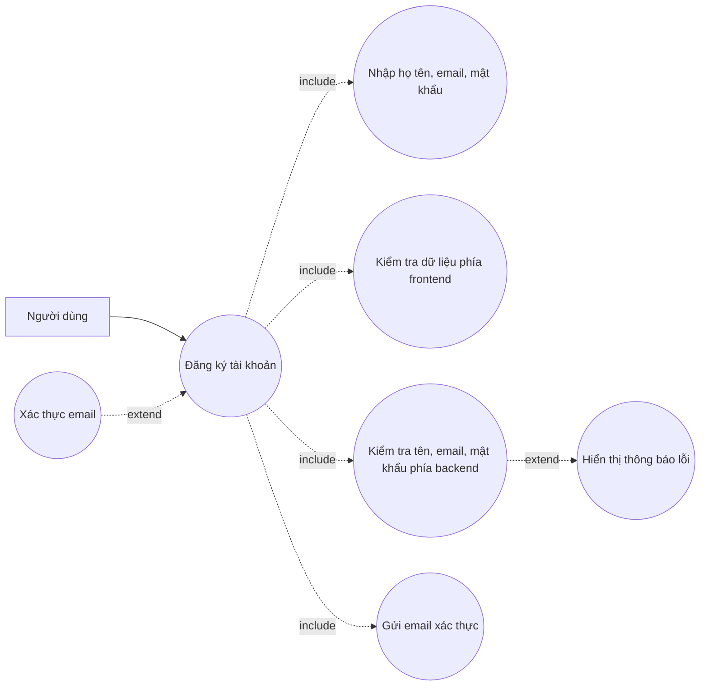
```mermaid
flowchart LR
  User[Người dùng] --> UC((Đăng ký tài khoản))
  UC -. include .-> Nhap((Nhập họ tên, email, mật khẩu))
  UC -. include .-> KiemTraFE((Kiểm tra dữ liệu phía frontend))
  UC -. include .-> KiemTraBE((Kiểm tra tên, email, mật khẩu phía backend))
  UC -. include .-> GuiMail((Gửi email xác thực))
  XacThuc((Xác thực email)) -. extend .-> UC
  KiemTraBE -. extend .-> Loi((Hiển thị thông báo lỗi))
```

### Bảng đặc tả UseCase đăng ký tài khoản

| UC | Đăng ký tài khoản |
|---|---|
| Tác nhân | Người dùng chưa có tài khoản |
| Mô tả | Người dùng nhập họ tên, email và mật khẩu. Hệ thống kiểm tra dữ liệu, kiểm tra email đã tồn tại hay chưa, sinh token xác thực và gửi email xác thực. Khi người dùng mở link xác thực, backend tạo tài khoản mới với mật khẩu đã mã hóa. |
| Tiền điều kiện | Người dùng chưa đăng nhập; email chưa tồn tại trong hệ thống. |
| Hậu điều kiện thành công | Email xác thực được gửi; sau khi xác thực email, tài khoản được tạo với vai trò mặc định `customer`. |
| Hậu điều kiện lỗi | Hệ thống hiển thị lỗi nếu thiếu dữ liệu, tên không hợp lệ, email không hợp lệ, mật khẩu dưới 8 ký tự, email đã được sử dụng, token xác thực không hợp lệ hoặc hết hạn. |

### Đặc tả chức năng

| Luồng | Nội dung |
|---|---|
| Luồng chính | 1. Người dùng mở trang đăng ký. |
|  | 2. Frontend hiển thị form nhập họ tên, email, mật khẩu. |
|  | 3. Người dùng nhập thông tin và nhấn Đăng ký. |
|  | 4. Frontend kiểm tra họ tên, email, mật khẩu không được để trống. |
|  | 5. Frontend gọi `POST /auth/register`. |
|  | 6. Backend kiểm tra tên không chứa số/ký tự đặc biệt. |
|  | 7. Backend kiểm tra định dạng email và mật khẩu tối thiểu 8 ký tự. |
|  | 8. Backend kiểm tra email đã tồn tại trong MongoDB. |
|  | 9. Backend sinh token xác thực hạn 15 phút và gửi email bằng Nodemailer. |
|  | 10. Frontend hiển thị thông báo yêu cầu kiểm tra email. |
|  | 11. Người dùng bấm link xác thực `GET /auth/verify-email?token=...`. |
|  | 12. Backend xác thực token, hash mật khẩu bằng bcrypt và tạo user. |
| Luồng phụ | 1. Nếu thiếu họ tên/email/mật khẩu, frontend hiển thị lỗi. |
|  | 2. Nếu tên, email hoặc mật khẩu không hợp lệ, backend trả lỗi. |
|  | 3. Nếu email đã tồn tại, backend trả lỗi `Email đã được sử dụng`. |
|  | 4. Nếu token xác thực không hợp lệ/hết hạn, backend trả lỗi. |

### Biểu đồ hoạt động chức năng đăng ký tài khoản

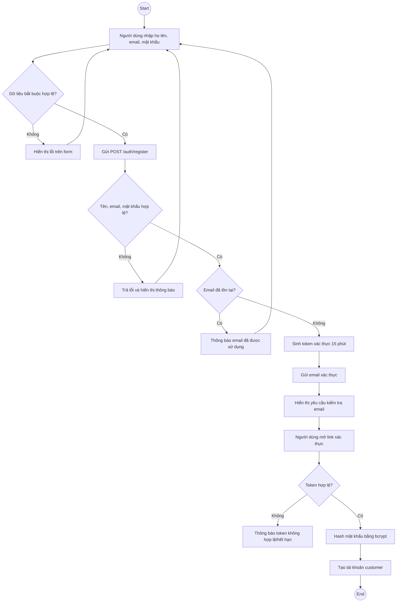
```mermaid
flowchart TB
  Start((Start)) --> Nhap[Người dùng nhập họ tên, email, mật khẩu]
  Nhap --> CheckFE{Dữ liệu bắt buộc hợp lệ?}
  CheckFE -- Không --> LoiFE[Hiển thị lỗi trên form] --> Nhap
  CheckFE -- Có --> GuiBE[Gửi POST /auth/register]
  GuiBE --> CheckBE{Tên, email, mật khẩu hợp lệ?}
  CheckBE -- Không --> LoiBE[Trả lỗi và hiển thị thông báo] --> Nhap
  CheckBE -- Có --> CheckEmail{Email đã tồn tại?}
  CheckEmail -- Có --> LoiEmail[Thông báo email đã được sử dụng] --> Nhap
  CheckEmail -- Không --> TaoToken[Sinh token xác thực 15 phút]
  TaoToken --> GuiMail[Gửi email xác thực]
  GuiMail --> ChoXacThuc[Hiển thị yêu cầu kiểm tra email]
  ChoXacThuc --> MoLink[Người dùng mở link xác thực]
  MoLink --> TokenOK{Token hợp lệ?}
  TokenOK -- Không --> LoiToken[Thông báo token không hợp lệ/hết hạn]
  TokenOK -- Có --> Hash[Hash mật khẩu bằng bcrypt]
  Hash --> TaoUser[Tạo tài khoản customer]
  TaoUser --> End((End))
```

### Biểu đồ tuần tự chức năng đăng ký tài khoản

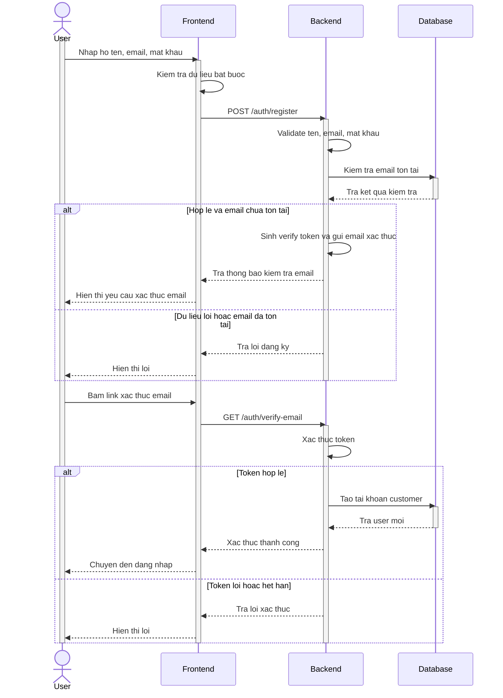
```mermaid
sequenceDiagram
  actor User as User
  participant FE as Frontend
  participant BE as Backend
  participant DB as Database

  activate User
  User->>FE: Nhap ho ten, email, mat khau
  activate FE
  FE->>FE: Kiem tra du lieu bat buoc
  FE->>BE: POST /auth/register
  activate BE
  BE->>BE: Validate ten, email, mat khau
  BE->>DB: Kiem tra email ton tai
  activate DB
  DB-->>BE: Tra ket qua kiem tra
  deactivate DB
  alt Hop le va email chua ton tai
    BE->>BE: Sinh verify token va gui email xac thuc
    BE-->>FE: Tra thong bao kiem tra email
    FE-->>User: Hien thi yeu cau xac thuc email
  else Du lieu loi hoac email da ton tai
    BE-->>FE: Tra loi dang ky
    FE-->>User: Hien thi loi
  end
  deactivate BE

  User->>FE: Bam link xac thuc email
  FE->>BE: GET /auth/verify-email
  activate BE
  BE->>BE: Xac thuc token
  alt Token hop le
    BE->>DB: Tao tai khoan customer
    activate DB
    DB-->>BE: Tra user moi
    deactivate DB
    BE-->>FE: Xac thuc thanh cong
    FE-->>User: Chuyen den dang nhap
  else Token loi hoac het han
    BE-->>FE: Tra loi xac thuc
    FE-->>User: Hien thi loi
  end
  deactivate BE
  deactivate FE
  deactivate User
```

## 3.3.8. Chức năng quản lý công thức

### Biểu đồ UseCase chức năng quản lý công thức

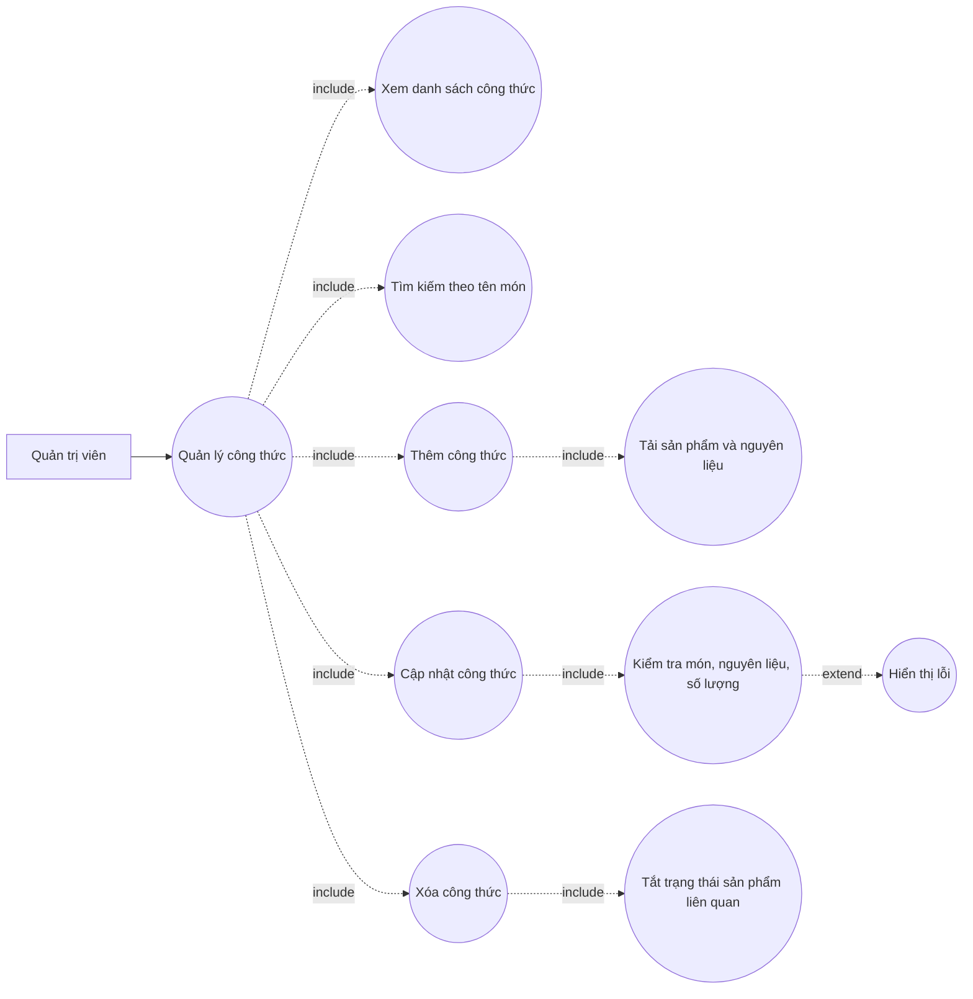
```mermaid
flowchart LR
  Admin[Quản trị viên] --> UC((Quản lý công thức))
  UC -. include .-> Xem((Xem danh sách công thức))
  UC -. include .-> Tim((Tìm kiếm theo tên món))
  UC -. include .-> Them((Thêm công thức))
  UC -. include .-> Sua((Cập nhật công thức))
  UC -. include .-> Xoa((Xóa công thức))
  Them -. include .-> LoadData((Tải sản phẩm và nguyên liệu))
  Sua -. include .-> Validate((Kiểm tra món, nguyên liệu, số lượng))
  Xoa -. include .-> TatSP((Tắt trạng thái sản phẩm liên quan))
  Validate -. extend .-> Loi((Hiển thị lỗi))
```

### Bảng đặc tả UseCase quản lý công thức

| UC | Quản lý công thức |
|---|---|
| Tác nhân | Quản trị viên |
| Mô tả | Admin xem danh sách công thức, tìm theo tên món, thêm công thức cho sản phẩm, cập nhật nguyên liệu/số lượng và xóa công thức. Khi xóa công thức, backend đồng thời cập nhật sản phẩm liên quan về trạng thái ngừng bán. |
| Tiền điều kiện | Admin đã đăng nhập; request có token hợp lệ và qua middleware `isAdmin`; hệ thống có dữ liệu sản phẩm/nguyên liệu khi thêm hoặc sửa. |
| Hậu điều kiện thành công | Công thức được tạo/cập nhật/xóa trong MongoDB; danh sách frontend được cập nhật; nếu xóa thì sản phẩm liên quan bị đặt `status: false`. |
| Hậu điều kiện lỗi | Hiển thị lỗi nếu thiếu dữ liệu, công thức của món đã tồn tại, số lượng nguyên liệu nhỏ hơn 1, nguyên liệu trùng, không tìm thấy công thức hoặc không đủ quyền. |

### Đặc tả chức năng

| Luồng | Nội dung |
|---|---|
| Luồng chính | 1. Admin mở trang Quản lý công thức. |
|  | 2. Frontend gọi `GET /recipes` để tải danh sách công thức. |
|  | 3. Admin tìm kiếm theo tên món nếu cần. |
|  | 4. Admin chọn thêm hoặc sửa công thức. |
|  | 5. Modal tải danh sách nguyên liệu và sản phẩm. |
|  | 6. Admin chọn món, chọn các nguyên liệu, nhập số lượng. |
|  | 7. Frontend kiểm tra món, nguyên liệu, số lượng và nguyên liệu trùng. |
|  | 8. Frontend gọi `POST /recipes` hoặc `PUT /recipes/:id`. |
|  | 9. Backend kiểm tra dữ liệu, kiểm tra công thức trùng theo `productId`. |
|  | 10. Backend lưu công thức và populate tên món, tên nguyên liệu để trả về. |
|  | 11. Frontend cập nhật danh sách và hiển thị thông báo thành công. |
| Luồng xóa | 1. Admin bấm xóa và xác nhận. |
|  | 2. Frontend gọi `DELETE /recipes/:id`. |
|  | 3. Backend xóa công thức. |
|  | 4. Backend cập nhật sản phẩm liên quan `status: false`. |
| Luồng phụ | 1. Nếu công thức cho món đã tồn tại, backend trả lỗi. |
|  | 2. Nếu số lượng nguyên liệu nhỏ hơn 1 hoặc nguyên liệu trùng, frontend/backend trả lỗi. |
|  | 3. Nếu không tìm thấy công thức, backend trả lỗi 404. |

### Biểu đồ hoạt động chức năng quản lý công thức

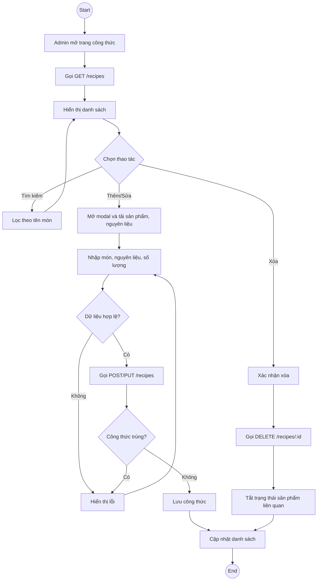
```mermaid
flowchart TB
  Start((Start)) --> Open[Admin mở trang công thức]
  Open --> Load[Gọi GET /recipes]
  Load --> List[Hiển thị danh sách]
  List --> Action{Chọn thao tác}
  Action -- Tìm kiếm --> Search[Lọc theo tên món] --> List
  Action -- Thêm/Sửa --> Modal[Mở modal và tải sản phẩm, nguyên liệu]
  Modal --> Input[Nhập món, nguyên liệu, số lượng]
  Input --> Check{Dữ liệu hợp lệ?}
  Check -- Không --> Error[Hiển thị lỗi] --> Input
  Check -- Có --> Save[Gọi POST/PUT /recipes]
  Save --> Dup{Công thức trùng?}
  Dup -- Có --> Error
  Dup -- Không --> Persist[Lưu công thức]
  Persist --> UpdateList[Cập nhật danh sách]
  Action -- Xóa --> Confirm[Xác nhận xóa]
  Confirm --> Delete[Gọi DELETE /recipes/:id]
  Delete --> DisableProduct[Tắt trạng thái sản phẩm liên quan]
  DisableProduct --> UpdateList
  UpdateList --> End((End))
```

### Biểu đồ tuần tự chức năng quản lý công thức

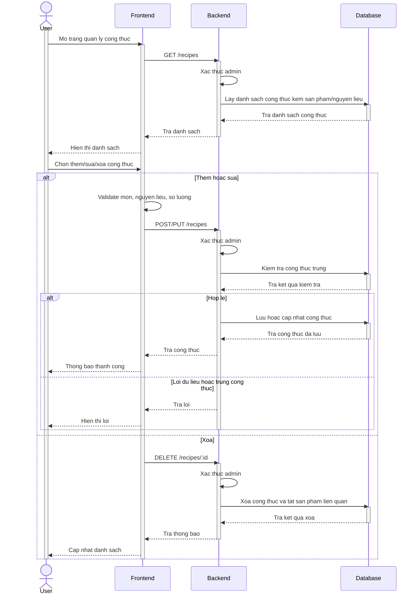
```mermaid
sequenceDiagram
  actor User as User
  participant FE as Frontend
  participant BE as Backend
  participant DB as Database

  activate User
  User->>FE: Mo trang quan ly cong thuc
  activate FE
  FE->>BE: GET /recipes
  activate BE
  BE->>BE: Xac thuc admin
  BE->>DB: Lay danh sach cong thuc kem san pham/nguyen lieu
  activate DB
  DB-->>BE: Tra danh sach cong thuc
  deactivate DB
  BE-->>FE: Tra danh sach
  deactivate BE
  FE-->>User: Hien thi danh sach

  User->>FE: Chon them/sua/xoa cong thuc
  alt Them hoac sua
    FE->>FE: Validate mon, nguyen lieu, so luong
    FE->>BE: POST/PUT /recipes
    activate BE
    BE->>BE: Xac thuc admin
    BE->>DB: Kiem tra cong thuc trung
    activate DB
    DB-->>BE: Tra ket qua kiem tra
    deactivate DB
    alt Hop le
      BE->>DB: Luu hoac cap nhat cong thuc
      activate DB
      DB-->>BE: Tra cong thuc da luu
      deactivate DB
      BE-->>FE: Tra cong thuc
      FE-->>User: Thong bao thanh cong
    else Loi du lieu hoac trung cong thuc
      BE-->>FE: Tra loi
      FE-->>User: Hien thi loi
    end
    deactivate BE
  else Xoa
    FE->>BE: DELETE /recipes/:id
    activate BE
    BE->>BE: Xac thuc admin
    BE->>DB: Xoa cong thuc va tat san pham lien quan
    activate DB
    DB-->>BE: Tra ket qua xoa
    deactivate DB
    BE-->>FE: Tra thong bao
    deactivate BE
    FE-->>User: Cap nhat danh sach
  end
  deactivate FE
  deactivate User
```

## 3.3.9. Chức năng tạo đơn offline

### Biểu đồ UseCase chức năng tạo đơn offline

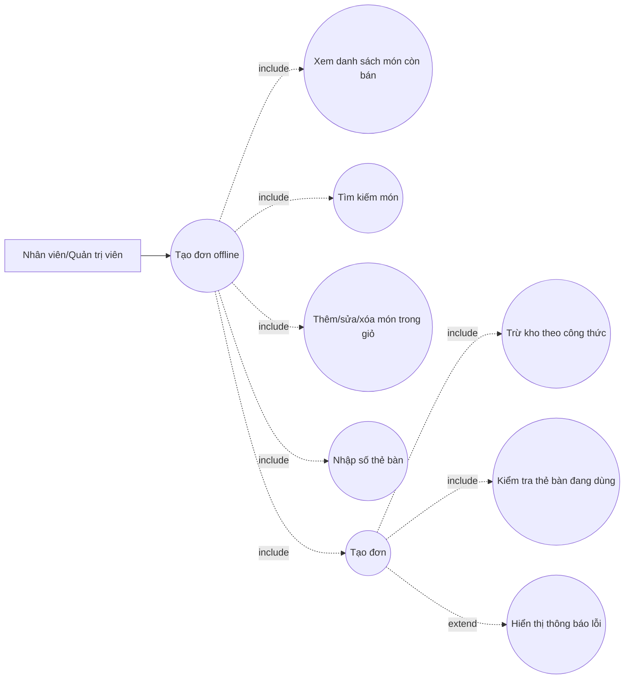
```mermaid
flowchart LR
  Staff[Nhân viên/Quản trị viên] --> UC((Tạo đơn offline))
  UC -. include .-> XemMon((Xem danh sách món còn bán))
  UC -. include .-> TimMon((Tìm kiếm món))
  UC -. include .-> GioHang((Thêm/sửa/xóa món trong giỏ))
  UC -. include .-> NhapThe((Nhập số thẻ bàn))
  UC -. include .-> TaoDon((Tạo đơn))
  TaoDon -. include .-> TruKho((Trừ kho theo công thức))
  TaoDon -. include .-> KiemTraThe((Kiểm tra thẻ bàn đang dùng))
  TaoDon -. extend .-> Loi((Hiển thị thông báo lỗi))
```

### Bảng đặc tả UseCase tạo đơn offline

| UC | Tạo đơn offline |
|---|---|
| Tác nhân | Nhân viên, quản trị viên |
| Mô tả | Nhân viên/admin chọn món còn bán, thêm vào giỏ, nhập số thẻ bàn và tạo đơn offline. Backend kiểm tra thẻ bàn chưa có đơn đang xử lý, tính tiền theo giá/giảm giá sản phẩm, kiểm tra công thức, trừ kho nguyên liệu trong transaction và tạo đơn thanh toán tiền mặt. |
| Tiền điều kiện | Người dùng đã đăng nhập với vai trò admin hoặc manager; sản phẩm còn bán; sản phẩm có công thức; kho đủ nguyên liệu. |
| Hậu điều kiện thành công | Đơn `OFFLINE` được tạo với `paymentMethod: CASH`, `paymentStatus: SUCCESS`, `status: PROCESSING`; nguyên liệu bị trừ theo công thức. |
| Hậu điều kiện lỗi | Không tạo đơn nếu chưa nhập thẻ, thẻ <= 0, giỏ hàng trống, chưa đăng nhập, thẻ đang được dùng, sản phẩm ngừng bán, sản phẩm chưa có công thức hoặc kho không đủ nguyên liệu. |

### Đặc tả chức năng

| Luồng | Nội dung |
|---|---|
| Luồng chính | 1. Nhân viên/admin mở trang gọi món offline. |
|  | 2. Frontend gọi API lấy danh sách sản phẩm và chỉ hiển thị sản phẩm `status === true`. |
|  | 3. Nhân viên tìm món, bấm món để thêm vào giỏ. |
|  | 4. Nhân viên tăng/giảm số lượng, xóa món hoặc nhập ghi chú. |
|  | 5. Nhân viên nhập số thẻ bàn. |
|  | 6. Frontend kiểm tra số thẻ hợp lệ, giỏ hàng không trống và user đã đăng nhập. |
|  | 7. Frontend gửi `POST /orders` với `userId`, `items`, `pagerNumber`. |
|  | 8. Backend mở MongoDB transaction. |
|  | 9. Backend kiểm tra thẻ bàn chưa có đơn `PROCESSING`. |
|  | 10. Backend tính tổng tiền theo giá sản phẩm sau discount. |
|  | 11. Backend tìm công thức từng món, trừ kho nguyên liệu bằng `$inc`. |
|  | 12. Backend tạo order offline và commit transaction. |
|  | 13. Frontend xóa giỏ, xóa số thẻ và thông báo thành công. |
| Luồng phụ | 1. Nếu thẻ bàn đang dùng, backend abort transaction và báo lỗi. |
|  | 2. Nếu sản phẩm ngừng bán hoặc chưa có công thức, backend abort transaction. |
|  | 3. Nếu kho không đủ nguyên liệu, backend abort transaction. |

### Biểu đồ hoạt động chức năng tạo đơn offline

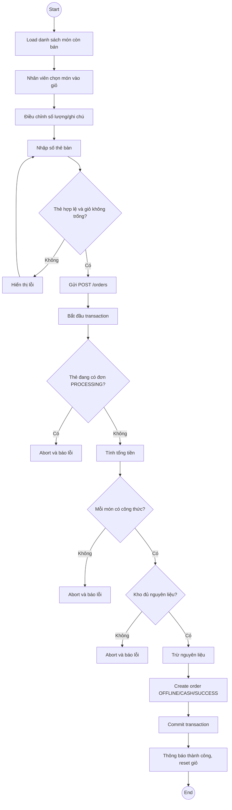
```mermaid
flowchart TB
  Start((Start)) --> Load[Load danh sách món còn bán]
  Load --> Select[Nhân viên chọn món vào giỏ]
  Select --> Cart[Điều chỉnh số lượng/ghi chú]
  Cart --> Pager[Nhập số thẻ bàn]
  Pager --> CheckFE{Thẻ hợp lệ và giỏ không trống?}
  CheckFE -- Không --> ErrFE[Hiển thị lỗi] --> Pager
  CheckFE -- Có --> Send[Gửi POST /orders]
  Send --> Tx[Bắt đầu transaction]
  Tx --> CheckPager{Thẻ đang có đơn PROCESSING?}
  CheckPager -- Có --> Abort1[Abort và báo lỗi]
  CheckPager -- Không --> Price[Tính tổng tiền]
  Price --> CheckRecipe{Mỗi món có công thức?}
  CheckRecipe -- Không --> Abort2[Abort và báo lỗi]
  CheckRecipe -- Có --> CheckStock{Kho đủ nguyên liệu?}
  CheckStock -- Không --> Abort3[Abort và báo lỗi]
  CheckStock -- Có --> Decrease[Trừ nguyên liệu]
  Decrease --> Create[Create order OFFLINE/CASH/SUCCESS]
  Create --> Commit[Commit transaction]
  Commit --> Success[Thông báo thành công, reset giỏ]
  Success --> End((End))
```

### Biểu đồ tuần tự chức năng tạo đơn offline

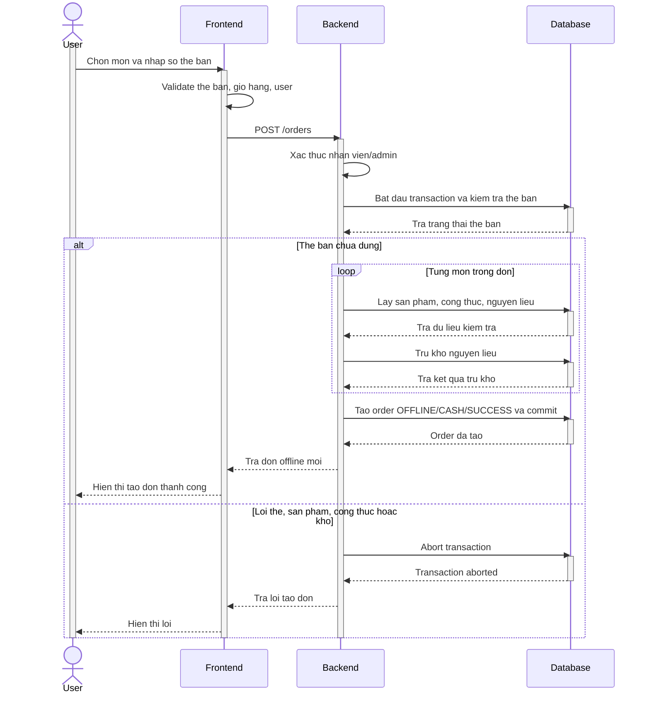
```mermaid
sequenceDiagram
  actor User as User
  participant FE as Frontend
  participant BE as Backend
  participant DB as Database

  activate User
  User->>FE: Chon mon va nhap so the ban
  activate FE
  FE->>FE: Validate the ban, gio hang, user
  FE->>BE: POST /orders
  activate BE
  BE->>BE: Xac thuc nhan vien/admin
  BE->>DB: Bat dau transaction va kiem tra the ban
  activate DB
  DB-->>BE: Tra trang thai the ban
  deactivate DB
  alt The ban chua dung
    loop Tung mon trong don
      BE->>DB: Lay san pham, cong thuc, nguyen lieu
      activate DB
      DB-->>BE: Tra du lieu kiem tra
      deactivate DB
      BE->>DB: Tru kho nguyen lieu
      activate DB
      DB-->>BE: Tra ket qua tru kho
      deactivate DB
    end
    BE->>DB: Tao order OFFLINE/CASH/SUCCESS va commit
    activate DB
    DB-->>BE: Order da tao
    deactivate DB
    BE-->>FE: Tra don offline moi
    FE-->>User: Hien thi tao don thanh cong
  else Loi the, san pham, cong thuc hoac kho
    BE->>DB: Abort transaction
    activate DB
    DB-->>BE: Transaction aborted
    deactivate DB
    BE-->>FE: Tra loi tao don
    FE-->>User: Hien thi loi
  end
  deactivate BE
  deactivate FE
  deactivate User
```

## 3.3.10. Chức năng quản lý voucher

### Biểu đồ UseCase chức năng quản lý voucher

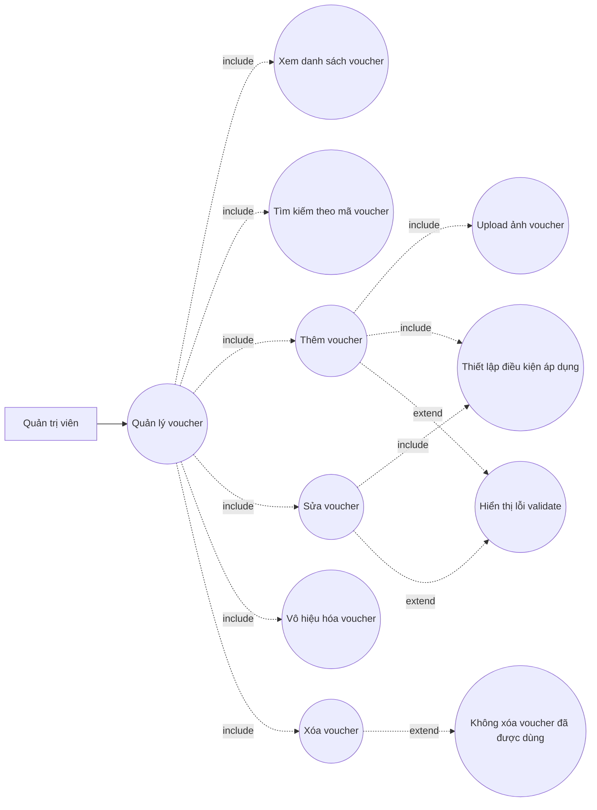
```mermaid
flowchart LR
  Admin[Quản trị viên] --> UC((Quản lý voucher))
  UC -. include .-> Xem((Xem danh sách voucher))
  UC -. include .-> Tim((Tìm kiếm theo mã voucher))
  UC -. include .-> Them((Thêm voucher))
  UC -. include .-> Sua((Sửa voucher))
  UC -. include .-> VoHieu((Vô hiệu hóa voucher))
  UC -. include .-> Xoa((Xóa voucher))
  Them -. include .-> Upload((Upload ảnh voucher))
  Them -. include .-> DieuKien((Thiết lập điều kiện áp dụng))
  Sua -. include .-> DieuKien
  Sua -. extend .-> Loi((Hiển thị lỗi validate))
  Xoa -. extend .-> ChanXoa((Không xóa voucher đã được dùng))
  Them -. extend .-> Loi
```

### Bảng đặc tả UseCase quản lý voucher

| UC | Quản lý voucher |
|---|---|
| Tác nhân | Quản trị viên |
| Mô tả | Admin xem danh sách voucher, tìm theo mã, tạo voucher mới, sửa thông tin voucher với loại giảm tiền/phần trăm, thời gian áp dụng, ảnh, giới hạn lượt dùng và điều kiện đơn hàng; admin có thể vô hiệu hóa hoặc xóa voucher chưa được sử dụng. |
| Tiền điều kiện | Admin đã đăng nhập; có token hợp lệ; khi tạo/sửa voucher cần ảnh và dữ liệu bắt buộc. |
| Hậu điều kiện thành công | Voucher được tạo, cập nhật, vô hiệu hóa hoặc xóa; danh sách frontend được cập nhật. Trạng thái hiển thị được tính theo thời gian: `upcoming`, `active`, `expired`, hoặc `inactive`. |
| Hậu điều kiện lỗi | Hiển thị lỗi nếu mã trùng, mã sai định dạng, thiếu dữ liệu, giá trị giảm không hợp lệ, thời gian kết thúc không hợp lệ, số lượt dùng sai hoặc voucher đã được sử dụng nên không thể xóa. |

### Đặc tả chức năng

| Luồng | Nội dung |
|---|---|
| Luồng chính | 1. Admin mở trang Quản lý voucher. |
|  | 2. Frontend gọi `GET /vouchers` và hiển thị danh sách. |
|  | 3. Admin tìm kiếm voucher theo mã nếu cần. |
|  | 4. Admin bấm thêm voucher. |
|  | 5. Modal tải danh mục sản phẩm để chọn điều kiện áp dụng. |
|  | 6. Admin nhập mã, mô tả, loại giảm, giá trị giảm, thời gian, ảnh, giới hạn và điều kiện. |
|  | 7. Frontend kiểm tra dữ liệu bằng `react-hook-form`. |
|  | 8. Frontend upload ảnh, lấy URL ảnh và gọi `POST /vouchers`. |
|  | 9. Backend kiểm tra mã trùng, regex mã, số liệu, thời gian và discount. |
|  | 10. Backend tạo voucher và populate danh mục áp dụng. |
|  | 11. Frontend thêm voucher vào danh sách và thông báo thành công. |
| Luồng sửa | 1. Admin chọn biểu tượng sửa ở một voucher. |
|  | 2. Frontend mở modal cập nhật với dữ liệu voucher hiện tại. |
|  | 3. Admin chỉnh mã, mô tả, loại giảm, giá trị giảm, thời gian, ảnh, giới hạn hoặc điều kiện áp dụng. |
|  | 4. Nếu admin không chọn ảnh mới, frontend giữ ảnh cũ. |
|  | 5. Frontend gọi `PUT /vouchers/:id`. |
|  | 6. Backend kiểm tra voucher tồn tại, mã không trùng voucher khác, thời gian/giá trị hợp lệ và `usageLimit` không nhỏ hơn `usedCount`. |
|  | 7. Backend cập nhật voucher, populate danh mục áp dụng và trả dữ liệu mới. |
|  | 8. Frontend cập nhật voucher trong danh sách và thông báo thành công. |
| Luồng vô hiệu hóa | 1. Admin chọn vô hiệu hóa voucher. |
|  | 2. Frontend gọi `PATCH /vouchers/deactivateVoucher/:id`. |
|  | 3. Backend đặt `status = inactive`. |
| Luồng xóa | 1. Admin chọn xóa voucher và xác nhận. |
|  | 2. Frontend gọi `DELETE /vouchers/deleteVoucher/:id`. |
|  | 3. Backend chỉ xóa nếu `usedCount === 0`. |
| Luồng phụ | 1. Nếu mã đã tồn tại hoặc sai định dạng, backend trả lỗi. |
|  | 2. Nếu voucher đã inactive, backend không cho vô hiệu hóa lại. |
|  | 3. Nếu voucher đã có lượt dùng, backend không cho xóa. |

### Biểu đồ hoạt động chức năng quản lý voucher

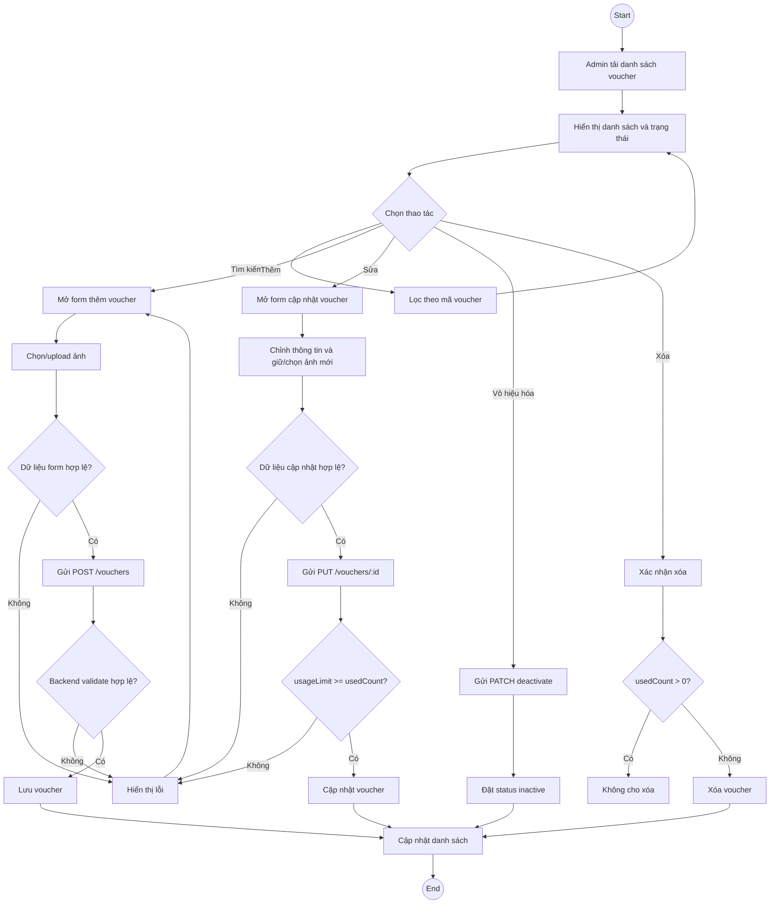
```mermaid
flowchart TB
  Start((Start)) --> Load[Admin tải danh sách voucher]
  Load --> List[Hiển thị danh sách và trạng thái]
  List --> Action{Chọn thao tác}
  Action -- Tìm kiếm --> Search[Lọc theo mã voucher] --> List
  Action -- Thêm --> Form[Mở form thêm voucher]
  Form --> Upload[Chọn/upload ảnh]
  Upload --> CheckFE{Dữ liệu form hợp lệ?}
  CheckFE -- Không --> Err[Hiển thị lỗi] --> Form
  CheckFE -- Có --> Create[Gửi POST /vouchers]
  Create --> CheckBE{Backend validate hợp lệ?}
  CheckBE -- Không --> Err
  CheckBE -- Có --> Save[Lưu voucher]
  Save --> Update[Cập nhật danh sách]
  Action -- Sửa --> Edit[Mở form cập nhật voucher]
  Edit --> Change[Chỉnh thông tin và giữ/chọn ảnh mới]
  Change --> CheckEdit{Dữ liệu cập nhật hợp lệ?}
  CheckEdit -- Không --> Err
  CheckEdit -- Có --> Put[Gửi PUT /vouchers/:id]
  Put --> CheckUsed{usageLimit >= usedCount?}
  CheckUsed -- Không --> Err
  CheckUsed -- Có --> UpdateVoucher[Cập nhật voucher] --> Update
  Action -- Vô hiệu hóa --> Deactivate[Gửi PATCH deactivate]
  Deactivate --> SetInactive[Đặt status inactive] --> Update
  Action -- Xóa --> Confirm[Xác nhận xóa]
  Confirm --> Used{usedCount > 0?}
  Used -- Có --> ErrDelete[Không cho xóa]
  Used -- Không --> Delete[Xóa voucher] --> Update
  Update --> End((End))
```

### Biểu đồ tuần tự chức năng quản lý voucher

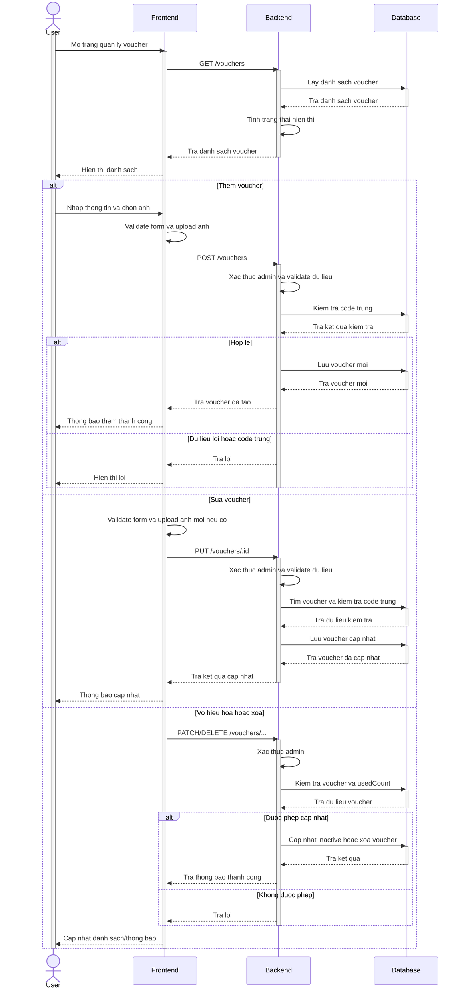
```mermaid
sequenceDiagram
  actor User as User
  participant FE as Frontend
  participant BE as Backend
  participant DB as Database

  activate User
  User->>FE: Mo trang quan ly voucher
  activate FE
  FE->>BE: GET /vouchers
  activate BE
  BE->>DB: Lay danh sach voucher
  activate DB
  DB-->>BE: Tra danh sach voucher
  deactivate DB
  BE->>BE: Tinh trang thai hien thi
  BE-->>FE: Tra danh sach voucher
  deactivate BE
  FE-->>User: Hien thi danh sach

  alt Them voucher
    User->>FE: Nhap thong tin va chon anh
    FE->>FE: Validate form va upload anh
    FE->>BE: POST /vouchers
    activate BE
    BE->>BE: Xac thuc admin va validate du lieu
    BE->>DB: Kiem tra code trung
    activate DB
    DB-->>BE: Tra ket qua kiem tra
    deactivate DB
    alt Hop le
      BE->>DB: Luu voucher moi
      activate DB
      DB-->>BE: Tra voucher moi
      deactivate DB
      BE-->>FE: Tra voucher da tao
      FE-->>User: Thong bao them thanh cong
    else Du lieu loi hoac code trung
      BE-->>FE: Tra loi
      FE-->>User: Hien thi loi
    end
    deactivate BE
  else Sua voucher
    FE->>FE: Validate form va upload anh moi neu co
    FE->>BE: PUT /vouchers/:id
    activate BE
    BE->>BE: Xac thuc admin va validate du lieu
    BE->>DB: Tim voucher va kiem tra code trung
    activate DB
    DB-->>BE: Tra du lieu kiem tra
    deactivate DB
    BE->>DB: Luu voucher cap nhat
    activate DB
    DB-->>BE: Tra voucher da cap nhat
    deactivate DB
    BE-->>FE: Tra ket qua cap nhat
    deactivate BE
    FE-->>User: Thong bao cap nhat
  else Vo hieu hoa hoac xoa
    FE->>BE: PATCH/DELETE /vouchers/...
    activate BE
    BE->>BE: Xac thuc admin
    BE->>DB: Kiem tra voucher va usedCount
    activate DB
    DB-->>BE: Tra du lieu voucher
    deactivate DB
    alt Duoc phep cap nhat
      BE->>DB: Cap nhat inactive hoac xoa voucher
      activate DB
      DB-->>BE: Tra ket qua
      deactivate DB
      BE-->>FE: Tra thong bao thanh cong
    else Khong duoc phep
      BE-->>FE: Tra loi
    end
    deactivate BE
    FE-->>User: Cap nhat danh sach/thong bao
  end
  deactivate FE
  deactivate User
```

## 3.3.11. Chức năng quản lý đặt bàn

### Biểu đồ UseCase chức năng quản lý đặt bàn

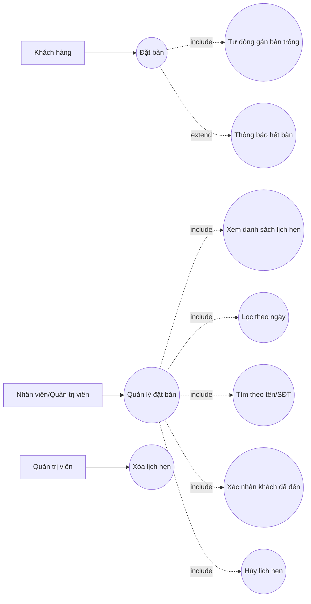
```mermaid
flowchart LR
  Customer[Khách hàng] --> DatBan((Đặt bàn))
  Staff[Nhân viên/Quản trị viên] --> QuanLy((Quản lý đặt bàn))
  QuanLy -. include .-> Xem((Xem danh sách lịch hẹn))
  QuanLy -. include .-> LocNgay((Lọc theo ngày))
  QuanLy -. include .-> Tim((Tìm theo tên/SĐT))
  QuanLy -. include .-> XacNhan((Xác nhận khách đã đến))
  QuanLy -. include .-> Huy((Hủy lịch hẹn))
  Admin[Quản trị viên] --> Xoa((Xóa lịch hẹn))
  DatBan -. include .-> GanBan((Tự động gán bàn trống))
  DatBan -. extend .-> HetBan((Thông báo hết bàn))
```

### Bảng đặc tả UseCase quản lý đặt bàn

| UC | Quản lý đặt bàn |
|---|---|
| Tác nhân | Khách hàng, nhân viên, quản trị viên |
| Mô tả | Khách hàng đặt bàn trong ngày với thông tin liên hệ, thời gian và số người. Hệ thống tự gán bàn còn trống trong 24 bàn theo khung giờ. Nhân viên/admin xem, tìm, lọc, xác nhận khách đã đến hoặc hủy lịch; admin có quyền xóa lịch đã hoàn tất hoặc đã hủy. |
| Tiền điều kiện | Khách nhập đủ thông tin đặt bàn; nhân viên/admin có token hợp lệ khi quản lý; admin mới được xóa. |
| Hậu điều kiện thành công | Lịch đặt bàn được tạo ở trạng thái `PENDING`; khi xác nhận chuyển sang `COMPLETED`; khi hủy chuyển sang `CANCELLED`; khi xóa thì bản ghi bị xóa khỏi MongoDB. |
| Hậu điều kiện lỗi | Không tạo nếu thiếu dữ liệu, thời gian không hợp lệ/quá khứ, hết bàn trong khung giờ. Không xác nhận/hủy nếu lịch không còn `PENDING`. Không xóa nếu lịch còn `PENDING`. |

### Đặc tả chức năng

| Luồng | Nội dung |
|---|---|
| Luồng khách đặt bàn | 1. Khách mở trang đặt bàn. |
|  | 2. Frontend hiển thị form họ tên, SĐT, email, ngày hiện tại, giờ, số người, ghi chú. |
|  | 3. Khách nhập thông tin và gửi form. |
|  | 4. Frontend validate họ tên, SĐT, email, số người 1-20. |
|  | 5. Frontend gọi `POST /reservations`. |
|  | 6. Backend kiểm tra dữ liệu bắt buộc và thời gian đặt không ở quá khứ. |
|  | 7. Backend tìm lịch cùng ngày/giờ có status khác `CANCELLED`. |
|  | 8. Backend gán số bàn trống từ 1 đến 24. |
|  | 9. Backend tạo lịch `PENDING` và trả số bàn. |
| Luồng admin/staff | 1. Nhân viên/admin mở trang quản lý lịch hẹn. |
|  | 2. Frontend gọi `GET /reservations?startDate&endDate`. |
|  | 3. Nhân viên/admin tìm theo tên/SĐT hoặc lọc nhanh theo ngày. |
|  | 4. Với lịch `PENDING`, nhân viên/admin xác nhận hoặc hủy. |
|  | 5. Frontend gọi `PATCH /reservations/:id/confirm` hoặc `/cancel`. |
|  | 6. Backend cập nhật trạng thái và trả lịch mới. |
|  | 7. Với lịch `COMPLETED` hoặc `CANCELLED`, admin có thể xóa bằng `DELETE /reservations/:id`. |
| Luồng phụ | 1. Nếu khung giờ đủ 24 bàn, backend báo hết bàn. |
|  | 2. Nếu lịch không ở trạng thái `PENDING`, backend không cho xác nhận/hủy. |
|  | 3. Nếu lịch còn `PENDING`, backend không cho xóa. |

### Biểu đồ hoạt động chức năng quản lý đặt bàn

```mermaid
flowchart TB
  Start((Start)) --> Actor{Tác nhân}
  Actor -- Khách hàng --> Form[Nhập thông tin đặt bàn]
  Form --> CheckFE{Form hợp lệ?}
  CheckFE -- Không --> ErrFE[Hiển thị lỗi] --> Form
  CheckFE -- Có --> Create[Gửi POST /reservations]
  Create --> TimeOK{Thời gian hợp lệ?}
  TimeOK -- Không --> ErrBE[Thông báo lỗi]
  TimeOK -- Có --> Table{Còn bàn trong khung giờ?}
  Table -- Không --> Full[Thông báo hết bàn]
  Table -- Có --> Assign[Gán bàn trống 1-24]
  Assign --> Pending[Tạo lịch PENDING]
  Pending --> Success[Hiển thị đặt bàn thành công]
  Actor -- Admin/Staff --> Load[Tải danh sách lịch hẹn]
  Load --> Filter[Tìm kiếm/lọc ngày]
  Filter --> Action{Chọn thao tác}
  Action -- Xác nhận --> Confirm[Cập nhật COMPLETED]
  Action -- Hủy --> Cancel[Cập nhật CANCELLED]
  Action -- Xóa --> Delete{Admin và lịch không PENDING?}
  Delete -- Có --> Remove[Xóa lịch]
  Delete -- Không --> ErrDel[Thông báo lỗi]
  Confirm --> End((End))
  Cancel --> End
  Remove --> End
  Success --> End
```

### Biểu đồ tuần tự chức năng quản lý đặt bàn

```mermaid
sequenceDiagram
  actor User as User
  participant FE as Frontend
  participant BE as Backend
  participant DB as Database

  activate User
  User->>FE: Nhap thong tin dat ban
  activate FE
  FE->>FE: Validate form dat ban
  FE->>BE: POST /reservations
  activate BE
  BE->>BE: Validate du lieu va thoi gian
  BE->>DB: Tim cac ban da dung theo thoi gian
  activate DB
  DB-->>BE: Tra danh sach ban da dung
  deactivate DB
  alt Con ban trong
    BE->>BE: Chon tableNumber trong tu 1 den 24
    BE->>DB: Tao reservation PENDING
    activate DB
    DB-->>BE: Tra lich dat ban moi
    deactivate DB
    BE-->>FE: Tra lich dat ban va so ban
    FE-->>User: Hien thi dat ban thanh cong
  else Het ban hoac du lieu loi
    BE-->>FE: Tra loi dat ban
    FE-->>User: Hien thi loi
  end
  deactivate BE

  User->>FE: Mo quan ly dat ban
  FE->>BE: GET /reservations
  activate BE
  BE->>BE: Xac thuc nhan vien/admin
  BE->>DB: Lay danh sach dat ban theo ngay
  activate DB
  DB-->>BE: Tra danh sach dat ban
  deactivate DB
  BE-->>FE: Tra danh sach
  deactivate BE
  FE-->>User: Hien thi danh sach

  alt Xac nhan hoac huy lich
    FE->>BE: PATCH /reservations/:id/confirm hoac cancel
    activate BE
    BE->>BE: Xac thuc quyen
    BE->>DB: Tim lich va cap nhat trang thai
    activate DB
    DB-->>BE: Tra lich da cap nhat
    deactivate DB
    BE-->>FE: Tra ket qua cap nhat
    deactivate BE
    FE-->>User: Cap nhat danh sach
  else Xoa lich
    FE->>BE: DELETE /reservations/:id
    activate BE
    BE->>BE: Xac thuc admin
    BE->>DB: Tim va xoa lich hop le
    activate DB
    DB-->>BE: Tra ket qua xoa
    deactivate DB
    BE-->>FE: Tra thong bao
    deactivate BE
    FE-->>User: Cap nhat danh sach
  end
  deactivate FE
  deactivate User
```

## 3.3.12. Chức năng quản lý người dùng

### Biểu đồ UseCase chức năng quản lý người dùng

```mermaid
flowchart LR
  Admin[Quản trị viên] --> UC((Quản lý người dùng))
  UC -. include .-> Xem((Xem danh sách người dùng))
  UC -. include .-> Loc((Lọc tất cả/nhân viên/admin))
  UC -. include .-> Tim((Tìm kiếm theo email))
  UC -. include .-> Sua((Cập nhật tên, email))
  UC -. include .-> PhanQuyen((Phân quyền))
  UC -. include .-> Xoa((Xóa người dùng))
  PhanQuyen -. extend .-> GiuAdmin((Không được mất admin cuối cùng))
  Xoa -. extend .-> ChanXoa((Không xóa tài khoản đang đăng nhập/admin cuối cùng))
```

### Bảng đặc tả UseCase quản lý người dùng

| UC | Quản lý người dùng |
|---|---|
| Tác nhân | Quản trị viên |
| Mô tả | Admin xem danh sách người dùng, lọc theo tất cả/nhân viên/admin, tìm theo email, cập nhật tên/email, phân quyền `customer`, `manager`, `admin` và xóa người dùng. |
| Tiền điều kiện | Admin đã đăng nhập; token hợp lệ; request qua middleware `isAdmin`. |
| Hậu điều kiện thành công | Thông tin người dùng, vai trò hoặc danh sách người dùng được cập nhật trên MongoDB và frontend. |
| Hậu điều kiện lỗi | Không cập nhật nếu tên/email trống, email sai định dạng, email trùng, role không hợp lệ, không tìm thấy user. Không đổi/xóa admin cuối cùng và không xóa tài khoản đang đăng nhập. |

### Đặc tả chức năng

| Luồng | Nội dung |
|---|---|
| Luồng chính | 1. Admin mở trang Quản lý người dùng. |
|  | 2. Frontend gọi `GET /users`, `GET /users/role/manager` hoặc `GET /users/role/admin` theo bộ lọc. |
|  | 3. Backend trả danh sách user và loại bỏ trường password. |
|  | 4. Admin tìm kiếm theo email nếu cần. |
|  | 5. Admin chọn sửa thông tin hoặc phân quyền. |
|  | 6. Frontend mở modal và gửi `PUT /users/:id` hoặc `PATCH /users/:id`. |
|  | 7. Backend kiểm tra dữ liệu, email trùng hoặc role hợp lệ. |
|  | 8. Backend cập nhật user và trả user không chứa password. |
|  | 9. Frontend cập nhật danh sách và thông báo thành công. |
| Luồng xóa | 1. Admin bấm xóa người dùng và xác nhận. |
|  | 2. Frontend gọi `DELETE /users/:id`. |
|  | 3. Backend kiểm tra không xóa chính tài khoản đang đăng nhập. |
|  | 4. Backend kiểm tra không xóa admin cuối cùng. |
|  | 5. Backend xóa user và frontend loại user khỏi danh sách. |
| Luồng phụ | 1. Nếu email đã được dùng bởi user khác, backend trả lỗi. |
|  | 2. Nếu role không thuộc `customer`, `manager`, `admin`, backend trả lỗi. |
|  | 3. Nếu chỉ còn một admin, backend không cho đổi role hoặc xóa admin đó. |

### Biểu đồ hoạt động chức năng quản lý người dùng

```mermaid
flowchart TB
  Start((Start)) --> Load[Admin tải danh sách user]
  Load --> Filter{Chọn bộ lọc}
  Filter -- Tất cả --> All[GET /users]
  Filter -- Nhân viên --> Manager[GET /users/role/manager]
  Filter -- Admin --> Admins[GET /users/role/admin]
  All --> List[Hiển thị danh sách]
  Manager --> List
  Admins --> List
  List --> Search[Tìm kiếm theo email]
  Search --> Action{Chọn thao tác}
  Action -- Sửa thông tin --> Edit[Nhập tên, email]
  Edit --> CheckInfo{Tên/email hợp lệ và không trùng?}
  CheckInfo -- Không --> Err[Hiển thị lỗi]
  CheckInfo -- Có --> SaveInfo[PUT /users/:id]
  Action -- Phân quyền --> Role[Chọn role]
  Role --> CheckRole{Role hợp lệ và còn admin?}
  CheckRole -- Không --> Err
  CheckRole -- Có --> SaveRole[PATCH /users/:id]
  Action -- Xóa --> Confirm[Xác nhận xóa]
  Confirm --> CheckDelete{Không phải user hiện tại và không phải admin cuối?}
  CheckDelete -- Không --> Err
  CheckDelete -- Có --> Delete[DELETE /users/:id]
  SaveInfo --> Update[Cập nhật danh sách]
  SaveRole --> Update
  Delete --> Update
  Update --> End((End))
```

### Biểu đồ tuần tự chức năng quản lý người dùng

```mermaid
sequenceDiagram
  actor User as User
  participant FE as Frontend
  participant BE as Backend
  participant DB as Database

  activate User
  User->>FE: Mo trang quan ly nguoi dung
  activate FE
  FE->>BE: GET /users hoac /users/role/...
  activate BE
  BE->>BE: Xac thuc token va quyen admin
  BE->>DB: Lay danh sach user, bo password
  activate DB
  DB-->>BE: Tra danh sach user
  deactivate DB
  BE-->>FE: Tra danh sach
  deactivate BE
  FE-->>User: Hien thi danh sach

  alt Cap nhat ten/email
    User->>FE: Nhap ten/email moi
    FE->>BE: PUT /users/:id
    activate BE
    BE->>DB: Kiem tra user, email trung va luu thay doi
    activate DB
    DB-->>BE: Tra ket qua cap nhat
    deactivate DB
    alt Cap nhat thanh cong
      BE-->>FE: Tra user da cap nhat
      FE-->>User: Thong bao thanh cong
    else Du lieu loi
      BE-->>FE: Tra loi
      FE-->>User: Hien thi loi
    end
    deactivate BE
  else Phan quyen
    User->>FE: Chon role moi
    FE->>BE: PATCH /users/:id
    activate BE
    BE->>DB: Kiem tra role, admin cuoi cung va cap nhat role
    activate DB
    DB-->>BE: Tra ket qua cap nhat role
    deactivate DB
    alt Hop le
      BE-->>FE: Tra user da cap nhat
    else Vi pham rang buoc admin
      BE-->>FE: Tra loi
    end
    deactivate BE
    FE-->>User: Cap nhat danh sach/thong bao
  else Xoa user
    User->>FE: Xac nhan xoa user
    FE->>BE: DELETE /users/:id
    activate BE
    BE->>DB: Kiem tra dieu kien xoa va xoa user
    activate DB
    DB-->>BE: Tra ket qua xoa
    deactivate DB
    alt Duoc phep xoa
      BE-->>FE: Tra thong bao xoa thanh cong
    else Khong duoc phep xoa
      BE-->>FE: Tra loi
    end
    deactivate BE
    FE-->>User: Cap nhat danh sach/thong bao
  end
  deactivate FE
  deactivate User
```

## Bổ sung. Chức năng quản lý sản phẩm

### Biểu đồ UseCase quản lý sản phẩm

```mermaid
flowchart LR
  Admin[Quan tri vien] --> UC((Quan ly san pham))
  Staff[Nhan vien/Quan tri vien] --> UC
  UC -. include .-> Xem((Xem danh sach san pham))
  UC -. include .-> Tim((Tim kiem theo ten san pham))
  UC -. include .-> Them((Them san pham))
  UC -. include .-> Sua((Cap nhat san pham))
  UC -. include .-> TrangThai((Bat/tat trang thai ban))
  UC -. include .-> Xoa((Xoa san pham))
  Them -. include .-> ChonDM((Chon danh muc san pham))
  Them -. include .-> Upload((Upload anh san pham))
  TrangThai -. include .-> CheckRecipe((Kiem tra cong thuc va kho))
  Xoa -. extend .-> ChanXoa((Khong xoa san pham dang co cong thuc))
```

### Bảng đặc tả UseCase quản lý sản phẩm

| UC | Quản lý sản phẩm |
|---|---|
| Tác nhân | Quản trị viên; nhân viên/quản lý với thao tác cập nhật trạng thái. |
| Mô tả | Người dùng quản trị xem danh sách sản phẩm, tìm kiếm theo tên, thêm sản phẩm mới, cập nhật thông tin sản phẩm, bật/tắt trạng thái bán và xóa sản phẩm. |
| Tiền điều kiện | Người dùng đã đăng nhập; thêm/sửa/xóa yêu cầu quyền admin; bật/tắt trạng thái yêu cầu admin hoặc manager. |
| Hậu điều kiện thành công | Sản phẩm được tạo/cập nhật/xóa hoặc thay đổi trạng thái trong MongoDB; frontend cập nhật lại danh sách. |
| Hậu điều kiện lỗi | Không tạo/sửa nếu thiếu dữ liệu, giá hoặc giảm giá không hợp lệ, tên trùng. Không bật bán nếu chưa có công thức hoặc kho không đủ. Không xóa sản phẩm đang dùng trong công thức. |

### Biểu đồ tuần tự quản lý sản phẩm

```mermaid
sequenceDiagram
  actor User as User
  participant FE as Frontend
  participant BE as Backend
  participant DB as Database

  activate User
  User->>FE: Mo trang quan ly san pham
  activate FE
  FE->>BE: GET /products
  activate BE
  BE->>DB: Lay danh sach san pham kem danh muc
  activate DB
  DB-->>BE: Tra danh sach san pham
  deactivate DB
  BE->>DB: Kiem tra cong thuc va ton kho de cap nhat trang thai
  activate DB
  DB-->>BE: Tra ket qua kiem tra
  deactivate DB
  BE-->>FE: Tra danh sach san pham
  deactivate BE
  FE-->>User: Hien thi danh sach

  alt Them hoac sua san pham
    User->>FE: Nhap thong tin san pham va chon anh
    FE->>FE: Validate form va upload anh
    FE->>BE: POST/PUT /products
    activate BE
    BE->>BE: Xac thuc quyen admin va validate du lieu
    BE->>DB: Kiem tra ten trung va luu san pham
    activate DB
    DB-->>BE: Tra san pham da luu
    deactivate DB
    alt Hop le
      BE-->>FE: Tra san pham moi/cap nhat
      FE-->>User: Thong bao thanh cong
    else Du lieu loi
      BE-->>FE: Tra loi
      FE-->>User: Hien thi loi
    end
    deactivate BE
  else Bat/tat trang thai ban
    User->>FE: Chon doi trang thai san pham
    FE->>BE: PATCH /products/:id
    activate BE
    BE->>BE: Xac thuc quyen admin/manager
    BE->>DB: Kiem tra cong thuc, nguyen lieu va cap nhat status
    activate DB
    DB-->>BE: Tra san pham da cap nhat
    deactivate DB
    BE-->>FE: Tra ket qua cap nhat
    deactivate BE
    FE-->>User: Cap nhat trang thai tren danh sach
  else Xoa san pham
    User->>FE: Xac nhan xoa san pham
    FE->>BE: DELETE /products/:id
    activate BE
    BE->>BE: Xac thuc quyen admin
    BE->>DB: Kiem tra san pham co cong thuc va xoa neu hop le
    activate DB
    DB-->>BE: Tra ket qua xoa
    deactivate DB
    alt Duoc phep xoa
      BE-->>FE: Tra thong bao xoa thanh cong
    else Dang duoc dung trong cong thuc
      BE-->>FE: Tra loi khong cho xoa
    end
    deactivate BE
    FE-->>User: Cap nhat danh sach/thong bao
  end
  deactivate FE
  deactivate User
```

## Bổ sung. Chức năng quản lý kho

### Biểu đồ UseCase quản lý kho

```mermaid
flowchart LR
  Staff[Nhan vien/Quan tri vien] --> UC((Quan ly kho))
  UC -. include .-> XemNL((Xem danh sach nguyen lieu))
  UC -. include .-> TimNL((Tim kiem nguyen lieu))
  UC -. include .-> ThemNL((Them nguyen lieu))
  UC -. include .-> SuaNL((Sua ten/don vi nguyen lieu))
  UC -. include .-> TrangThaiNL((Bat/tat trang thai nguyen lieu))
  UC -. include .-> XoaNL((Xoa nguyen lieu))
  UC -. include .-> NhapKho((Tao phieu nhap kho))
  UC -. include .-> XuatKho((Tao phieu xuat kho))
  UC -. include .-> XemPhieu((Xem danh sach/chi tiet phieu kho))
  XoaNL -. extend .-> ChanXoa((Khong xoa nguyen lieu dang dung trong cong thuc))
  XuatKho -. extend .-> LoiKho((Khong xuat qua ton kho))
```

### Bảng đặc tả UseCase quản lý kho

| UC | Quản lý kho |
|---|---|
| Tác nhân | Nhân viên, quản trị viên. |
| Mô tả | Người dùng quản trị quản lý nguyên liệu trong kho, gồm xem danh sách, tìm kiếm, thêm/sửa/xóa nguyên liệu, bật/tắt trạng thái nguyên liệu, tạo phiếu nhập kho, tạo phiếu xuất kho và xem lịch sử phiếu kho. |
| Tiền điều kiện | Người dùng đã đăng nhập với quyền admin hoặc manager. Thao tác sửa/xóa nguyên liệu yêu cầu quyền admin theo router hiện tại. |
| Hậu điều kiện thành công | Nguyên liệu hoặc phiếu kho được cập nhật; số lượng, tổng giá trị tồn kho, đơn giá gần nhất và trạng thái nguyên liệu được cập nhật. |
| Hậu điều kiện lỗi | Không cho trùng tên nguyên liệu, không xóa nguyên liệu đang dùng trong công thức, không xuất kho vượt quá số lượng tồn, không bật nguyên liệu đã hết hàng. |

### Biểu đồ tuần tự quản lý kho

```mermaid
sequenceDiagram
  actor User as User
  participant FE as Frontend
  participant BE as Backend
  participant DB as Database

  activate User
  User->>FE: Mo trang quan ly kho
  activate FE
  FE->>BE: GET /ingredients
  activate BE
  BE->>BE: Xac thuc quyen admin/manager
  BE->>DB: Lay danh sach nguyen lieu
  activate DB
  DB-->>BE: Tra danh sach nguyen lieu
  deactivate DB
  BE-->>FE: Tra danh sach
  deactivate BE
  FE-->>User: Hien thi danh sach kho

  alt Them hoac sua nguyen lieu
    User->>FE: Nhap ten va don vi nguyen lieu
    FE->>BE: POST/PUT /ingredients
    activate BE
    BE->>DB: Kiem tra ten trung va luu nguyen lieu
    activate DB
    DB-->>BE: Tra nguyen lieu da luu
    deactivate DB
    BE-->>FE: Tra ket qua luu
    deactivate BE
    FE-->>User: Cap nhat danh sach kho
  else Bat/tat trang thai nguyen lieu
    User->>FE: Chon doi trang thai nguyen lieu
    FE->>BE: PATCH /ingredients/:id
    activate BE
    BE->>DB: Cap nhat status nguyen lieu va tat san pham lien quan neu can
    activate DB
    DB-->>BE: Tra trang thai moi
    deactivate DB
    BE-->>FE: Tra ket qua cap nhat
    deactivate BE
    FE-->>User: Cap nhat trang thai
  else Xoa nguyen lieu
    User->>FE: Xac nhan xoa nguyen lieu
    FE->>BE: DELETE /ingredients/:id
    activate BE
    BE->>DB: Kiem tra cong thuc lien quan va xoa nguyen lieu
    activate DB
    DB-->>BE: Tra ket qua xoa
    deactivate DB
    alt Duoc phep xoa
      BE-->>FE: Tra thong bao xoa thanh cong
    else Dang duoc dung trong cong thuc
      BE-->>FE: Tra loi khong cho xoa
    end
    deactivate BE
    FE-->>User: Cap nhat danh sach/thong bao
  end
  deactivate FE
  deactivate User
```

### Biểu đồ tuần tự nhập/xuất kho

```mermaid
sequenceDiagram
  actor User as User
  participant FE as Frontend
  participant BE as Backend
  participant DB as Database

  activate User
  User->>FE: Mo trang nhap/xuat kho
  activate FE
  FE->>BE: GET /import-receipts
  activate BE
  BE->>BE: Xac thuc quyen admin/manager
  BE->>DB: Lay danh sach phieu theo khoang ngay
  activate DB
  DB-->>BE: Tra danh sach phieu
  deactivate DB
  BE-->>FE: Tra danh sach phieu
  deactivate BE
  FE-->>User: Hien thi lich su phieu kho

  alt Tao phieu nhap kho
    User->>FE: Nhap nguyen lieu, so luong, tong tien
    FE->>BE: POST /import-receipts/import
    activate BE
    BE->>DB: Tao phieu IMPORT va cong ton kho
    activate DB
    DB-->>BE: Tra phieu nhap moi
    deactivate DB
    BE-->>FE: Tra ket qua nhap kho
    deactivate BE
    FE-->>User: Cap nhat danh sach phieu
  else Tao phieu xuat kho
    User->>FE: Nhap nguyen lieu va so luong xuat
    FE->>BE: POST /import-receipts/export
    activate BE
    BE->>DB: Kiem tra ton kho, tao phieu EXPORT va tru kho
    activate DB
    DB-->>BE: Tra phieu xuat moi
    deactivate DB
    alt Ton kho du
      BE-->>FE: Tra ket qua xuat kho
    else Xuat qua ton kho
      BE-->>FE: Tra loi xuat kho
    end
    deactivate BE
    FE-->>User: Cap nhat danh sach/thong bao
  else Xem chi tiet phieu
    User->>FE: Chon xem chi tiet phieu
    FE->>BE: GET /import-receipts/:id
    activate BE
    BE->>DB: Lay chi tiet phieu kho
    activate DB
    DB-->>BE: Tra chi tiet phieu
    deactivate DB
    BE-->>FE: Tra chi tiet phieu
    deactivate BE
    FE-->>User: Hien thi modal chi tiet
  end
  deactivate FE
  deactivate User
```

## Bổ sung. Chức năng quản lý đơn hàng

### Biểu đồ UseCase quản lý đơn hàng

```mermaid
flowchart LR
  Staff[Nhan vien/Quan tri vien] --> UC((Quan ly don hang))
  UC -. include .-> Xem((Xem danh sach don hang))
  UC -. include .-> Loc((Loc theo ngay, loai don, thanh toan, trang thai))
  UC -. include .-> XemCT((Xem chi tiet don hang))
  UC -. include .-> XacNhanTT((Xac nhan thanh toan tien mat))
  UC -. include .-> HoanThanh((Hoan thanh don hang))
  UC -. include .-> Huy((Huy don hang tien mat))
  Huy -. include .-> HoanKho((Hoan nguyen lieu vao kho))
  Xem -. include .-> Realtime((Nhan thong bao don moi realtime))
```

### Bảng đặc tả UseCase quản lý đơn hàng

| UC | Quản lý đơn hàng |
|---|---|
| Tác nhân | Nhân viên, quản trị viên. |
| Mô tả | Người dùng quản trị xem danh sách đơn hàng theo khoảng ngày, lọc theo loại đơn, trạng thái thanh toán, trạng thái xử lý, xem chi tiết đơn, xác nhận thanh toán tiền mặt, hoàn thành đơn hàng và hủy đơn hàng tiền mặt. |
| Tiền điều kiện | Người dùng đã đăng nhập với quyền admin hoặc manager. |
| Hậu điều kiện thành công | Đơn hàng được cập nhật trạng thái thanh toán hoặc trạng thái xử lý; nếu hủy đơn tiền mặt, nguyên liệu được hoàn lại kho và voucher được giảm lượt dùng nếu có. |
| Hậu điều kiện lỗi | Không hoàn thành đơn chưa thanh toán thành công; không hủy đơn đã hoàn tất/đã hủy; không hủy thủ công đơn không dùng phương thức tiền mặt. |

### Biểu đồ tuần tự quản lý đơn hàng

```mermaid
sequenceDiagram
  actor User as User
  participant FE as Frontend
  participant BE as Backend
  participant DB as Database

  activate User
  User->>FE: Mo trang quan ly don hang
  activate FE
  FE->>BE: GET /orders?startDate&endDate
  activate BE
  BE->>BE: Xac thuc quyen admin/manager
  BE->>DB: Lay danh sach don theo khoang ngay
  activate DB
  DB-->>BE: Tra danh sach don hang
  deactivate DB
  BE-->>FE: Tra danh sach don
  deactivate BE
  FE-->>User: Hien thi danh sach va bo loc

  alt Xem chi tiet don
    User->>FE: Chon xem chi tiet don
    FE->>BE: GET /orders/:orderId
    activate BE
    BE->>DB: Lay chi tiet don hang
    activate DB
    DB-->>BE: Tra chi tiet don
    deactivate DB
    BE-->>FE: Tra chi tiet don
    deactivate BE
    FE-->>User: Hien thi modal chi tiet
  else Xac nhan thanh toan tien mat
    User->>FE: Xac nhan da thu tien
    FE->>BE: PATCH /orders/:id/confirm-payment
    activate BE
    BE->>DB: Cap nhat paymentStatus = SUCCESS
    activate DB
    DB-->>BE: Tra don da cap nhat
    deactivate DB
    BE-->>FE: Tra ket qua thanh toan
    deactivate BE
    FE-->>User: Cap nhat trang thai thanh toan
  else Hoan thanh don
    User->>FE: Xac nhan hoan thanh don
    FE->>BE: PATCH /orders/:id/complete
    activate BE
    BE->>DB: Kiem tra thanh toan va cap nhat COMPLETED
    activate DB
    DB-->>BE: Tra don da cap nhat
    deactivate DB
    BE-->>FE: Tra ket qua hoan thanh
    deactivate BE
    FE-->>User: Cap nhat trang thai don
  else Huy don tien mat
    User->>FE: Xac nhan huy don
    FE->>BE: PATCH /orders/:id/cancel
    activate BE
    BE->>DB: Kiem tra don, hoan nguyen lieu va cap nhat CANCELLED
    activate DB
    DB-->>BE: Tra don da huy
    deactivate DB
    alt Huy thanh cong
      BE-->>FE: Tra ket qua huy don
    else Khong duoc phep huy
      BE-->>FE: Tra loi huy don
    end
    deactivate BE
    FE-->>User: Cap nhat danh sach/thong bao
  end
  deactivate FE
  deactivate User
```

## Bổ sung 3.3.6. Chức năng quản lý danh mục sản phẩm

### Biểu đồ UseCase quản lý danh mục sản phẩm

```mermaid
flowchart LR
  Admin[Quản trị viên] --> UC((Quản lý danh mục sản phẩm))
  UC -. include .-> Xem((Xem danh sách danh mục))
  UC -. include .-> Tim((Tìm kiếm theo tên))
  UC -. include .-> Them((Thêm danh mục))
  UC -. include .-> Sua((Cập nhật danh mục))
  UC -. include .-> Xoa((Xóa danh mục))
  Them -. include .-> Upload((Upload ảnh danh mục))
  Sua -. include .-> Upload
  Xoa -. extend .-> ChanXoa((Không xóa danh mục đang chứa sản phẩm))
  Them -. extend .-> Loi((Hiển thị lỗi validate))
  Sua -. extend .-> Loi
```

### Bảng đặc tả UseCase quản lý danh mục sản phẩm

| UC | Quản lý danh mục sản phẩm |
|---|---|
| Tác nhân | Quản trị viên |
| Mô tả | Admin quản lý các loại sản phẩm hiển thị trên menu, gồm xem danh sách, tìm kiếm, thêm mới, cập nhật tên/ảnh và xóa danh mục. Hệ thống tự sinh `slug` từ tên danh mục. |
| Tiền điều kiện | Admin đã đăng nhập; request thêm/sửa/xóa có token hợp lệ và quyền admin. |
| Hậu điều kiện thành công | Danh mục sản phẩm được tạo/cập nhật/xóa trong MongoDB; frontend cập nhật lại danh sách. |
| Hậu điều kiện lỗi | Không cho thêm/sửa nếu tên trùng hoặc thiếu ảnh. Không cho xóa nếu danh mục đang chứa sản phẩm. |

### Đặc tả chức năng

| Luồng | Nội dung |
|---|---|
| Luồng chính | 1. Admin mở trang Quản lý loại sản phẩm. |
|  | 2. Frontend gọi `GET /product-categories` để tải danh sách. |
|  | 3. Admin tìm kiếm danh mục theo tên nếu cần. |
|  | 4. Admin thêm danh mục bằng cách nhập tên và chọn ảnh. |
|  | 5. Frontend upload ảnh lên Cloudinary và gọi `POST /product-categories`. |
|  | 6. Backend kiểm tra slug trùng, tạo danh mục và tự sinh slug. |
|  | 7. Admin có thể cập nhật tên/ảnh bằng `PUT /product-categories/:id`. |
|  | 8. Admin có thể xóa danh mục bằng `DELETE /product-categories/:id`. |
| Luồng phụ | 1. Nếu danh mục đang chứa sản phẩm, backend không cho xóa. |
|  | 2. Nếu tên danh mục trùng danh mục khác, backend trả lỗi. |
|  | 3. Nếu thiếu tên hoặc ảnh, frontend hiển thị thông báo lỗi. |

### Biểu đồ hoạt động quản lý danh mục sản phẩm

```mermaid
flowchart TB
  Start((Start)) --> Load[Tải danh sách danh mục sản phẩm]
  Load --> List[Hiển thị danh sách]
  List --> Action{Chọn thao tác}
  Action -- Tìm kiếm --> Search[Lọc theo tên] --> List
  Action -- Thêm/Sửa --> Form[Nhập tên và chọn ảnh]
  Form --> Valid{Dữ liệu hợp lệ?}
  Valid -- Không --> Error[Hiển thị lỗi] --> Form
  Valid -- Có --> Upload[Upload ảnh nếu có ảnh mới]
  Upload --> Save[Gửi POST/PUT product-categories]
  Save --> Duplicate{Tên/slug trùng?}
  Duplicate -- Có --> Error
  Duplicate -- Không --> Update[Cập nhật danh sách]
  Action -- Xóa --> Confirm[Xác nhận xóa]
  Confirm --> HasProduct{Danh mục có sản phẩm?}
  HasProduct -- Có --> DeleteError[Không cho xóa]
  HasProduct -- Không --> Delete[Xóa danh mục] --> Update
  Update --> End((End))
```

### Biểu đồ tuần tự quản lý danh mục sản phẩm

```mermaid
sequenceDiagram
  actor User as User
  participant FE as Frontend
  participant BE as Backend
  participant DB as Database

  activate User
  User->>FE: Mo quan ly danh muc san pham
  activate FE
  FE->>BE: GET /product-categories
  activate BE
  BE->>BE: Xac thuc token va quyen admin
  BE->>DB: Lay danh sach danh muc san pham
  activate DB
  DB-->>BE: Tra danh sach danh muc
  deactivate DB
  BE-->>FE: Tra danh sach
  deactivate BE
  FE-->>User: Hien thi danh sach

  alt Them hoac sua danh muc
    User->>FE: Nhap ten va chon anh
    FE->>FE: Validate form va upload anh
    FE->>BE: POST/PUT /product-categories
    activate BE
    BE->>DB: Kiem tra ten/slug trung va luu danh muc
    activate DB
    DB-->>BE: Tra ket qua luu danh muc
    deactivate DB
    alt Hop le
      BE-->>FE: Tra danh muc da luu
      FE-->>User: Thong bao thanh cong
    else Ten/slug trung hoac thieu du lieu
      BE-->>FE: Tra loi
      FE-->>User: Hien thi loi
    end
    deactivate BE
  else Xoa danh muc
    User->>FE: Xac nhan xoa danh muc
    FE->>BE: DELETE /product-categories/:id
    activate BE
    BE->>DB: Kiem tra san pham lien quan va xoa danh muc
    activate DB
    DB-->>BE: Tra ket qua xoa
    deactivate DB
    alt Khong co san pham
      BE-->>FE: Tra thong bao xoa thanh cong
    else Dang chua san pham
      BE-->>FE: Tra loi khong cho xoa
    end
    deactivate BE
    FE-->>User: Cap nhat danh sach/thong bao
  end
  deactivate FE
  deactivate User
```

## 3.3.13. Chức năng quản lý bài viết và danh mục bài viết

### Biểu đồ UseCase quản lý bài viết và danh mục bài viết

```mermaid
flowchart LR
  Admin[Quản trị viên] --> BlogUC((Quản lý bài viết))
  Staff[Nhân viên/Quản trị viên] --> CatUC((Quản lý danh mục bài viết))
  BlogUC -. include .-> XemBlog((Xem danh sách bài viết))
  BlogUC -. include .-> TimBlog((Tìm theo tiêu đề))
  BlogUC -. include .-> ThemBlog((Thêm bài viết))
  BlogUC -. include .-> SuaBlog((Cập nhật bài viết))
  BlogUC -. include .-> XoaBlog((Xóa bài viết))
  BlogUC -. include .-> XemTruoc((Xem trước bài viết))
  CatUC -. include .-> XemCat((Xem danh mục))
  CatUC -. include .-> ThemCat((Thêm danh mục))
  CatUC -. include .-> SuaCat((Sửa danh mục))
  CatUC -. include .-> XoaCat((Xóa danh mục))
  XoaCat -. extend .-> ChanXoa((Không xóa danh mục đang chứa bài viết))
```

### Bảng đặc tả UseCase quản lý bài viết và danh mục bài viết

| UC | Quản lý bài viết và danh mục bài viết |
|---|---|
| Tác nhân | Quản trị viên; nhân viên/quản trị viên với danh mục bài viết |
| Mô tả | Admin tạo, sửa, xóa, xem trước và tìm kiếm bài viết trên website. Bài viết thuộc một danh mục bài viết. Danh mục bài viết có thể thêm, sửa, xóa và tự sinh slug từ tên. |
| Tiền điều kiện | Người dùng có quyền phù hợp; bài viết khi tạo/sửa phải có tiêu đề, danh mục, nội dung và ảnh. |
| Hậu điều kiện thành công | Bài viết hoặc danh mục bài viết được lưu trong MongoDB; trang tin tức hiển thị theo slug danh mục và slug bài viết. |
| Hậu điều kiện lỗi | Không cho tạo bài viết trùng tiêu đề. Không cho xóa danh mục đang chứa bài viết. Không tìm thấy danh mục/slug thì trang tin tức không tải được bài tương ứng. |

### Đặc tả chức năng

| Luồng | Nội dung |
|---|---|
| Luồng quản lý bài viết | 1. Admin mở trang Quản lý bài viết. |
|  | 2. Frontend gọi `GET /blogs` để tải danh sách bài viết và populate danh mục. |
|  | 3. Admin tìm kiếm theo tiêu đề, xem trước bài viết nếu cần. |
|  | 4. Admin thêm bài viết: nhập tiêu đề, chọn danh mục, nhập nội dung 3 phần và chọn ảnh. |
|  | 5. Frontend gọi `POST /blogs`. Backend kiểm tra đủ dữ liệu và tiêu đề không trùng. |
|  | 6. Admin cập nhật bài viết bằng `PUT /blogs/:id`. |
|  | 7. Admin xóa bài viết bằng `DELETE /blogs/:id` sau khi xác nhận. |
| Luồng danh mục bài viết | 1. Admin/nhân viên mở trang Quản lý danh mục bài viết. |
|  | 2. Frontend gọi `GET /blog-categories`. |
|  | 3. Người dùng thêm hoặc sửa tên danh mục. Backend tự sinh slug từ tên. |
|  | 4. Người dùng xóa danh mục bằng `DELETE /blog-categories/:id`. |
| Luồng phụ | 1. Nếu tiêu đề bài viết đã tồn tại, backend trả lỗi. |
|  | 2. Nếu danh mục đang chứa bài viết, backend không cho xóa danh mục. |
|  | 3. Nếu tên danh mục trùng hoặc rỗng, backend trả lỗi. |

### Biểu đồ hoạt động quản lý bài viết và danh mục bài viết

```mermaid
flowchart TB
  Start((Start)) --> Choose{Chọn quản lý}
  Choose -- Bài viết --> LoadBlog[Tải danh sách bài viết]
  LoadBlog --> BlogAction{Thao tác bài viết}
  BlogAction -- Tìm/Xem trước --> Preview[Tìm kiếm hoặc xem trước] --> LoadBlog
  BlogAction -- Thêm/Sửa --> BlogForm[Nhập tiêu đề, danh mục, nội dung, ảnh]
  BlogForm --> BlogValid{Dữ liệu hợp lệ?}
  BlogValid -- Không --> Error[Hiển thị lỗi]
  BlogValid -- Có --> SaveBlog[Gửi POST/PUT /blogs]
  SaveBlog --> BlogDup{Tiêu đề trùng?}
  BlogDup -- Có --> Error
  BlogDup -- Không --> UpdateBlog[Cập nhật danh sách]
  BlogAction -- Xóa --> DeleteBlog[Xác nhận và xóa bài viết] --> UpdateBlog
  Choose -- Danh mục --> LoadCat[Tải danh mục bài viết]
  LoadCat --> CatAction{Thao tác danh mục}
  CatAction -- Thêm/Sửa --> CatForm[Nhập tên danh mục]
  CatForm --> SaveCat[Gửi POST/PUT /blog-categories]
  CatAction -- Xóa --> HasBlog{Danh mục có bài viết?}
  HasBlog -- Có --> Error
  HasBlog -- Không --> DeleteCat[Xóa danh mục]
  SaveCat --> End((End))
  DeleteCat --> End
  UpdateBlog --> End
```

### Bieu do tuan tu quan ly bai viet

```mermaid
sequenceDiagram
  actor User as User
  participant FE as Frontend
  participant BE as Backend
  participant DB as Database

  activate User
  User->>FE: Mo quan ly bai viet
  activate FE
  FE->>BE: GET /blogs
  activate BE
  BE->>BE: Kiem tra quyen truy cap neu thao tac admin
  BE->>DB: Lay danh sach bai viet kem danh muc
  activate DB
  DB-->>BE: Tra danh sach bai viet
  deactivate DB
  BE-->>FE: Tra danh sach bai viet
  deactivate BE
  FE-->>User: Hien thi danh sach

  alt Them hoac sua bai viet
    User->>FE: Nhap tieu de, danh muc, noi dung, anh
    FE->>FE: Validate form va upload anh neu co
    FE->>BE: POST/PUT /blogs
    activate BE
    BE->>DB: Kiem tra tieu de, danh muc va luu bai viet
    activate DB
    DB-->>BE: Tra ket qua luu bai viet
    deactivate DB
    alt Hop le
      BE-->>FE: Tra bai viet moi/cap nhat
      FE-->>User: Thong bao thanh cong
    else Du lieu loi
      BE-->>FE: Tra loi
      FE-->>User: Hien thi loi
    end
    deactivate BE
  else Xoa bai viet
    User->>FE: Xac nhan xoa bai viet
    FE->>BE: DELETE /blogs/:id
    activate BE
    BE->>DB: Xoa bai viet
    activate DB
    DB-->>BE: Tra ket qua xoa
    deactivate DB
    BE-->>FE: Tra thong bao xoa
    deactivate BE
    FE-->>User: Cap nhat danh sach
  end
  deactivate FE
  deactivate User
```

### Bieu do tuan tu quan ly danh muc bai viet

```mermaid
sequenceDiagram
  actor User as User
  participant FE as Frontend
  participant BE as Backend
  participant DB as Database

  activate User
  User->>FE: Mo quan ly danh muc bai viet
  activate FE
  FE->>BE: GET /blog-categories
  activate BE
  BE->>BE: Kiem tra quyen nhan vien/admin neu thao tac quan tri
  BE->>DB: Lay danh muc bai viet
  activate DB
  DB-->>BE: Tra danh muc
  deactivate DB
  BE-->>FE: Tra danh muc
  deactivate BE
  FE-->>User: Hien thi danh muc

  alt Them hoac sua danh muc bai viet
    User->>FE: Nhap ten danh muc
    FE->>BE: POST/PUT /blog-categories
    activate BE
    BE->>DB: Kiem tra trung va luu danh muc
    activate DB
    DB-->>BE: Tra ket qua luu danh muc
    deactivate DB
    BE-->>FE: Tra danh muc da luu
    deactivate BE
    FE-->>User: Cap nhat danh muc
  else Xoa danh muc bai viet
    User->>FE: Xac nhan xoa danh muc
    FE->>BE: DELETE /blog-categories/:id
    activate BE
    BE->>DB: Kiem tra bai viet lien quan va xoa danh muc
    activate DB
    DB-->>BE: Tra ket qua xoa
    deactivate DB
    alt Khong co bai viet
      BE-->>FE: Tra thong bao xoa
    else Dang chua bai viet
      BE-->>FE: Tra loi khong cho xoa
    end
    deactivate BE
    FE-->>User: Cap nhat danh muc/thong bao
  end
  deactivate FE
  deactivate User
```

## 3.3.14. Chức năng liên hệ và quản lý phản hồi khách hàng

### Biểu đồ UseCase liên hệ và quản lý phản hồi

```mermaid
flowchart LR
  Customer[Khách hàng] --> Contact((Gửi liên hệ))
  Contact -. include .-> Input((Nhập tên, email, SĐT, nội dung))
  Contact -. include .-> Submit((Gửi lời nhắn))
  Admin[Quản trị viên] --> Manage((Quản lý lời nhắn))
  Manage -. include .-> View((Xem danh sách))
  Manage -. include .-> Filter((Lọc tất cả/đã đọc/chưa đọc))
  Manage -. include .-> Search((Tìm theo email))
  Manage -. include .-> Read((Đánh dấu đã đọc))
  Manage -. include .-> Delete((Xóa lời nhắn))
  Submit -. extend .-> Error((Hiển thị lỗi validate))
```

### Bảng đặc tả UseCase liên hệ và quản lý phản hồi

| UC | Liên hệ và quản lý phản hồi khách hàng |
|---|---|
| Tác nhân | Khách hàng, quản trị viên |
| Mô tả | Khách hàng gửi lời nhắn qua form liên hệ. Admin xem danh sách lời nhắn, lọc theo trạng thái đã đọc/chưa đọc, tìm theo email, đánh dấu đã đọc và xóa lời nhắn. |
| Tiền điều kiện | Khách nhập đủ tên, email, số điện thoại và nội dung. Admin đã đăng nhập và có quyền admin để quản lý lời nhắn. |
| Hậu điều kiện thành công | Lời nhắn được tạo với trạng thái mặc định `new`; admin có thể cập nhật trạng thái `read` hoặc xóa khỏi hệ thống. |
| Hậu điều kiện lỗi | Không gửi nếu thiếu thông tin hoặc email/SĐT không hợp lệ. Admin không có quyền sẽ bị middleware chặn. |

### Đặc tả chức năng

| Luồng | Nội dung |
|---|---|
| Luồng khách gửi liên hệ | 1. Khách hàng mở trang Liên hệ. |
|  | 2. Frontend hiển thị form tên, email, số điện thoại và nội dung. |
|  | 3. Frontend validate tên, email, SĐT và nội dung. |
|  | 4. Frontend gọi `POST /contacts`. |
|  | 5. Backend kiểm tra dữ liệu bắt buộc và tạo contact với `status = new`. |
|  | 6. Frontend hiển thị thông báo gửi thành công. |
| Luồng admin quản lý | 1. Admin mở trang Quản lý lời nhắn khách hàng. |
|  | 2. Frontend gọi `GET /contacts`, `/contacts/unread` hoặc `/contacts/read` theo bộ lọc. |
|  | 3. Admin tìm kiếm theo email nếu cần. |
|  | 4. Admin đánh dấu đã đọc bằng `PUT /contacts/read/:id`. |
|  | 5. Admin xóa lời nhắn bằng `DELETE /contacts/:id` sau khi xác nhận. |
| Luồng phụ | 1. Nếu thiếu thông tin, backend trả lỗi `Thiếu thông tin bắt buộc`. |
|  | 2. Nếu không tìm thấy lời nhắn khi xóa/đánh dấu đã đọc, backend trả lỗi 404. |

### Biểu đồ hoạt động liên hệ và quản lý phản hồi

```mermaid
flowchart TB
  Start((Start)) --> Actor{Tác nhân}
  Actor -- Khách hàng --> Form[Nhập form liên hệ]
  Form --> Valid{Dữ liệu hợp lệ?}
  Valid -- Không --> Error[Hiển thị lỗi]
  Valid -- Có --> Send[Gửi POST /contacts]
  Send --> Created[Tạo lời nhắn trạng thái new]
  Created --> Success[Thông báo thành công]
  Actor -- Admin --> Load[Tải danh sách lời nhắn]
  Load --> Filter[Lọc tất cả/đã đọc/chưa đọc]
  Filter --> Search[Tìm kiếm email]
  Search --> Action{Chọn thao tác}
  Action -- Đánh dấu đã đọc --> Mark[PUT /contacts/read/:id]
  Action -- Xóa --> Confirm[Xác nhận xóa]
  Confirm --> Delete[DELETE /contacts/:id]
  Mark --> End((End))
  Delete --> End
  Success --> End
```

### Biểu đồ tuần tự liên hệ và quản lý phản hồi

```mermaid
sequenceDiagram
  actor User as User
  participant FE as Frontend
  participant BE as Backend
  participant DB as Database

  activate User
  User->>FE: Nhap ten, email, SDT, noi dung lien he
  activate FE
  FE->>FE: Validate form lien he
  FE->>BE: POST /contacts
  activate BE
  BE->>DB: Validate va tao contact trang thai new
  activate DB
  DB-->>BE: Tra ket qua tao contact
  deactivate DB
  alt Du lieu hop le
    BE-->>FE: Tra contact moi
    FE-->>User: Thong bao gui thanh cong
  else Du lieu loi
    BE-->>FE: Tra loi validate
    FE-->>User: Hien thi loi
  end
  deactivate BE

  User->>FE: Mo quan ly loi nhan
  FE->>BE: GET /contacts hoac /contacts/read hoac /contacts/unread
  activate BE
  BE->>BE: Xac thuc token va quyen admin
  BE->>DB: Lay danh sach contact theo bo loc
  activate DB
  DB-->>BE: Tra danh sach contact
  deactivate DB
  BE-->>FE: Tra danh sach loi nhan
  deactivate BE
  FE-->>User: Hien thi danh sach

  alt Danh dau da doc
    User->>FE: Chon danh dau da doc
    FE->>BE: PUT /contacts/read/:id
    activate BE
    BE->>DB: Cap nhat status = read
    activate DB
    DB-->>BE: Tra contact da cap nhat
    deactivate DB
    BE-->>FE: Tra ket qua cap nhat
    deactivate BE
    FE-->>User: Cap nhat danh sach
  else Xoa loi nhan
    User->>FE: Xac nhan xoa loi nhan
    FE->>BE: DELETE /contacts/:id
    activate BE
    BE->>DB: Xoa contact
    activate DB
    DB-->>BE: Tra ket qua xoa
    deactivate DB
    BE-->>FE: Tra thong bao xoa
    deactivate BE
    FE-->>User: Cap nhat danh sach
  end
  deactivate FE
  deactivate User
```

## 3.3.15. Chức năng AI gọi món

### Biểu đồ UseCase AI gọi món

```mermaid
flowchart LR
  Customer[Khách hàng đã đăng nhập] --> AIOrder((AI gọi món))
  AIOrder -. include .-> OpenChat((Mở trợ lý tư vấn AI))
  AIOrder -. include .-> Ask((Nhập câu hỏi về khẩu vị, giá, ưu đãi))
  AIOrder -. include .-> Recommend((Xem gợi ý món cá nhân hóa))
  AIOrder -. include .-> ViewDetail((Xem chi tiết món được gợi ý))
  AIOrder -. include .-> Auth((Xác thực token người dùng))
  Recommend -. extend .-> Fallback((Gợi ý fallback khi AI hết quota))
  Ask -. extend .-> Error((Thông báo lỗi khi AI không phản hồi))
```

### Bảng đặc tả UseCase AI gợi ý món

| UC | AI gợi ý món |
|---|---|
| Tác nhân | Khách hàng đã đăng nhập |
| Mô tả | Khách hàng mở trang menu, hệ thống tự động lấy danh sách gợi ý món cá nhân hóa dựa trên lịch sử đặt hàng và menu đang bán. Khách hàng cũng có thể mở trợ lý AI để đặt câu hỏi về khẩu vị, mức giá, món đang giảm giá hoặc món phù hợp theo nhu cầu. |
| Tiền điều kiện | Người dùng đã đăng nhập; token hợp lệ; hệ thống có sản phẩm đang bán. |
| Hậu điều kiện thành công | Hệ thống trả về danh sách gợi ý món hoặc câu trả lời AI; khách hàng có thể mở chi tiết món được đề xuất. |
| Hậu điều kiện lỗi | Nếu token không hợp lệ hoặc AI lỗi, frontend hiển thị thông báo tương ứng; nếu Gemini hết quota, backend dùng cơ chế fallback từ dữ liệu menu và lịch sử đơn hàng. |

### Đặc tả chức năng

| Luồng | Nội dung |
|---|---|
| Luồng lấy gợi ý tự động | 1. Khách hàng đã đăng nhập mở trang Menu. |
|  | 2. Frontend tải danh sách sản phẩm, danh mục, voucher đang khả dụng. |
|  | 3. `useEffect` gọi `GET /ai/recommend-products` nếu có `user`. |
|  | 4. Backend `verifyToken` xác thực người dùng. |
|  | 5. Backend lấy tối đa 40 sản phẩm đang bán và tối đa 12 đơn hàng gần nhất chưa bị hủy của người dùng. |
|  | 6. Backend tạo prompt gửi Gemini để sinh tối đa 5 món gợi ý kèm lý do và điểm số. |
|  | 7. Nếu Gemini trả dữ liệu hợp lệ, backend ánh xạ `productId` sang sản phẩm thực tế và trả về `recommendations`. |
|  | 8. Nếu Gemini bị lỗi quota `429`, backend tạo gợi ý fallback dựa trên lịch sử mua, danh mục thường dùng, giảm giá và độ mới của sản phẩm. |
|  | 9. Frontend hiển thị khối “Gợi ý dành cho bạn”; khách hàng có thể bấm vào món để mở modal chi tiết. |
| Luồng chat với trợ lý AI | 1. Khách hàng bấm `Mở trợ lý tư vấn AI`. |
|  | 2. Frontend hiển thị khung chat với lời chào mặc định và các câu hỏi gợi ý. |
|  | 3. Khách hàng nhập câu hỏi và gửi form. |
|  | 4. Frontend gọi `POST /ai/chat` với `message`. |
|  | 5. Backend kiểm tra `message` không rỗng, lấy tối đa 40 sản phẩm đang bán và 5 đơn hàng gần nhất của người dùng. |
|  | 6. Backend dựng prompt yêu cầu AI chỉ tư vấn trong phạm vi menu THREESTAR, trả lời tiếng Việt, ngắn gọn tối đa 4 câu. |
|  | 7. Backend gọi Gemini để sinh câu trả lời. |
|  | 8. Nếu Gemini hết quota `429`, backend trả lời fallback bằng cách chọn tối đa 3 sản phẩm phù hợp theo từ khóa như `giảm`, `cà phê`, `matcha`. |
|  | 9. Frontend thêm phản hồi của AI vào danh sách `chatMessages`. |
| Luồng phụ | 1. Nếu người dùng chưa đăng nhập, frontend không hiển thị khối AI và không gọi API AI. |
|  | 2. Nếu `message` rỗng, backend trả lỗi `Vui lòng nhập nội dung cần hỏi`. |
|  | 3. Nếu chưa cấu hình `GEMINI_API_KEY`, backend trả lỗi `Chưa cấu hình GEMINI_API_KEY`. |
|  | 4. Nếu AI không phản hồi được, frontend hiển thị thông điệp lỗi trong khung chat hoặc bỏ qua phần gợi ý tự động. |

### Biểu đồ hoạt động AI gọi món

```mermaid
flowchart TB
  Start((Start)) --> Login{Đã đăng nhập?}
  Login -- Không --> HideAI[Ẩn khối AI trên trang menu] --> End((End))
  Login -- Có --> LoadMenu[Tải menu, danh mục, voucher]
  LoadMenu --> AutoCall[Gọi GET /ai/recommend-products]
  AutoCall --> Verify{Token hợp lệ?}
  Verify -- Không --> ErrorAuth[Trả lỗi xác thực] --> End
  Verify -- Có --> GeminiRecommend{Gemini khả dụng?}
  GeminiRecommend -- Có --> AIResult[Trả danh sách gợi ý AI]
  GeminiRecommend -- Hết quota 429 --> FallbackRecommend[Tạo gợi ý fallback]
  AIResult --> ShowRecommend[Hiển thị khối gợi ý]
  FallbackRecommend --> ShowRecommend
  ShowRecommend --> OpenChat{Khách mở trợ lý AI?}
  OpenChat -- Không --> End
  OpenChat -- Có --> Input[Nhập câu hỏi]
  Input --> CheckMsg{Nội dung rỗng?}
  CheckMsg -- Có --> ErrorMsg[Thông báo lỗi]
  ErrorMsg --> Input
  CheckMsg -- Không --> ChatAPI[Gửi POST /ai/chat]
  ChatAPI --> GeminiChat{Gemini khả dụng?}
  GeminiChat -- Có --> Reply[Trả lời từ AI]
  GeminiChat -- Hết quota 429 --> FallbackChat[Trả lời fallback theo menu]
  Reply --> ShowChat[Hiển thị phản hồi]
  FallbackChat --> ShowChat
  ShowChat --> End
```

### Biểu đồ tuần tự AI gọi món

```mermaid
sequenceDiagram
  actor User as User
  participant FE as Frontend
  participant BE as Backend
  participant DB as Database
  participant AI as Gemini

  activate User
  User->>FE: Mở trang Menu khi đã đăng nhập
  activate FE
  FE->>BE: GET /ai/recommend-products
  activate BE
  BE->>BE: verifyToken
  BE->>DB: Lấy sản phẩm đang bán và lịch sử order gần đây
  activate DB
  DB-->>BE: Trả dữ liệu menu và đơn hàng
  deactivate DB
  alt Gemini phản hồi bình thường
    BE->>AI: Gửi prompt gợi ý món
    AI-->>BE: Trả JSON recommendations
    BE-->>FE: Trả recommendations
  else Gemini hết quota 429
    BE->>BE: Tạo recommendations fallback
    BE-->>FE: Trả recommendations fallback
  else Lỗi cấu hình hoặc lỗi hệ thống
    BE-->>FE: Trả lỗi AI
  end
  FE-->>User: Hiển thị gợi ý món cá nhân hóa

  User->>FE: Mở trợ lý AI và nhập câu hỏi
  FE->>BE: POST /ai/chat { message }
  activate BE
  BE->>BE: Kiểm tra message và verifyToken
  BE->>DB: Lấy sản phẩm đang bán và lịch sử order gần đây
  activate DB
  DB-->>BE: Trả dữ liệu
  deactivate DB
  alt Gemini phản hồi bình thường
    BE->>AI: Gửi prompt chat tư vấn món
    AI-->>BE: Trả reply
    BE-->>FE: Trả reply
  else Gemini hết quota 429
    BE->>BE: Sinh reply fallback theo từ khóa và menu
    BE-->>FE: Trả reply fallback
  else Lỗi khác
    BE-->>FE: Trả lỗi chat AI
  end
  FE-->>User: Hiển thị tin nhắn trả lời
  deactivate BE
  deactivate FE
  deactivate User
```

## 3.3.16. Chức năng dashboard thống kê

### Biểu đồ UseCase dashboard thống kê

```mermaid
flowchart LR
  Manager[Admin/Manager] --> Dashboard((Xem dashboard thống kê))
  Dashboard -. include .-> Auth((Xác thực và phân quyền))
  Dashboard -. include .-> Filter((Lọc theo khoảng ngày))
  Dashboard -. include .-> Overview((Xem chỉ số tổng quan))
  Dashboard -. include .-> Revenue((Xem doanh thu, giá vốn, lãi gộp))
  Dashboard -. include .-> Inventory((Xem nguyên liệu sắp hết))
  Dashboard -. include .-> Orders((Xem đơn hàng mới nhất và top sản phẩm))
  Filter -. extend .-> QuickRange((Chọn nhanh hôm nay, hôm qua, 7 ngày, 30 ngày))
  Auth -. extend .-> Forbidden((Từ chối truy cập nếu sai vai trò))
```

### Bảng đặc tả UseCase dashboard thống kê

| UC | Dashboard thống kê |
|---|---|
| Tác nhân | Admin, Manager |
| Mô tả | Người quản trị hoặc quản lý truy cập khu vực `/admin` để xem báo cáo tổng quan theo ngày, gồm doanh thu, giá vốn, lãi gộp, đơn hàng, đặt bàn, cảnh báo kho, người dùng, voucher, nguyên liệu sắp hết, sản phẩm bán chạy và đơn hàng mới nhất. |
| Tiền điều kiện | Người dùng đã đăng nhập; token hợp lệ; vai trò là `admin` hoặc `manager`. |
| Hậu điều kiện thành công | Dashboard hiển thị đầy đủ số liệu tổng hợp trong khoảng ngày được chọn. |
| Hậu điều kiện lỗi | Nếu không có quyền hoặc lỗi truy vấn dữ liệu, hệ thống trả lỗi và frontend hiển thị thông báo tải dashboard thất bại. |

### Đặc tả chức năng

| Luồng | Nội dung |
|---|---|
| Luồng chính | 1. Admin/manager truy cập route `/admin`; `AdminGuard` cho phép vào khu vực quản trị. |
|  | 2. Trang `Dashboard` khởi tạo `startDate` và `endDate` mặc định là hôm nay. |
|  | 3. `useEffect` gọi `GET /dashboard/summary?startDate=...&endDate=...` khi bộ lọc ngày thay đổi. |
|  | 4. Backend `verifyToken` xác thực JWT, `isAdminOrStaff` kiểm tra vai trò `admin` hoặc `manager`. |
|  | 5. Controller dựng khoảng thời gian đầu ngày - cuối ngày từ `startDate`, `endDate`. |
|  | 6. Backend dùng `Promise.all` để tổng hợp song song dữ liệu từ `Order`, `User`, `Product`, `Ingredient`, `Voucher`, `Contact`, `Reservation`, `ImportReceipt`. |
|  | 7. Backend tính các nhóm số liệu: doanh thu đã thanh toán, giá vốn, lãi gộp, biên lãi gộp, tổng đơn, trạng thái đơn/thanh toán, số user, số sản phẩm, số đặt bàn, voucher hoạt động, tin nhắn chưa đọc, giá trị tồn kho, phiếu nhập và chi phí nhập nguyên liệu. |
|  | 8. Backend tổng hợp `topProducts`, `recentOrders`, `lowStockIngredients` và trả JSON về frontend. |
|  | 9. Frontend hiển thị các thẻ thống kê, bảng breakdown, bảng sản phẩm bán chạy, bảng nguyên liệu sắp hết và bảng đơn hàng mới nhất. |
| Luồng lọc dữ liệu | 1. Người dùng chọn nhanh `Hôm nay`, `Hôm qua`, `7 ngày`, `30 ngày` hoặc tự chọn `Từ ngày` / `Đến ngày`. |
|  | 2. Frontend cập nhật `startDate`, `endDate` và gọi lại API dashboard. |
|  | 3. Nút `Tải lại` cho phép gọi lại API với bộ lọc hiện tại. |
| Luồng phụ | 1. Nếu token không hợp lệ hoặc người dùng không phải `admin/manager`, backend trả lỗi 401/403. |
|  | 2. Nếu không có dữ liệu trong kỳ, dashboard vẫn hiển thị với giá trị mặc định `0` và các bảng rỗng. |
|  | 3. Ngưỡng cảnh báo tồn kho được tính theo đơn vị: `g/ml <= 1000`, `cái <= 10`, còn lại mặc định `<= 100`. |

### Biểu đồ hoạt động dashboard thống kê

```mermaid
flowchart TB
  Start((Start)) --> Open[Mở dashboard]
  Open --> Select[Chọn khoảng ngày]
  Select --> CallAPI[Gọi API dashboard]
  CallAPI --> Process[Backend tổng hợp số liệu]
  Process --> Render[Hiển thị dashboard]
  Render --> Filter{Đổi bộ lọc ngày?}
  Filter -- Có --> Select
  Filter -- Không --> End
```

### Biểu đồ tuần tự dashboard thống kê

```mermaid
sequenceDiagram
  actor User as Admin/Manager
  participant FE as Frontend
  participant BE as Backend
  participant DB as Database

  activate User
  User->>FE: Mở /admin
  activate FE
  FE->>FE: Khởi tạo startDate, endDate
  FE->>BE: GET /dashboard/summary?startDate&endDate
  activate BE
  BE->>DB: Aggregate orders, users, products, ingredients, vouchers, contacts, reservations, importReceipts
  activate DB
  DB-->>BE: Trả dữ liệu tổng hợp
  deactivate DB
  BE->>BE: Chuẩn hóa breakdowns và tính KPI tài chính
  BE-->>FE: Trả summary dashboard
  FE-->>User: Hiển thị thẻ số liệu và các bảng thống kê

  User->>FE: Chọn khoảng ngày khác hoặc bấm Tải lại
  FE->>BE: GET /dashboard/summary với bộ lọc mới
  activate BE
  BE->>DB: Truy vấn lại dữ liệu theo ngày
  activate DB
  DB-->>BE: Trả kết quả mới
  deactivate DB
  BE-->>FE: Trả dashboard cập nhật
  deactivate BE
  FE-->>User: Cập nhật giao diện dashboard
  deactivate FE
  deactivate User
```
